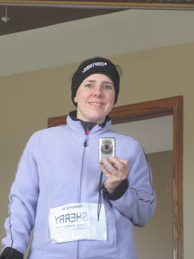

Today I set out for my first "long run" of my half marathon training. 4 miles is what I have typically been running on a weekend so it didn't feel like a long run.  
  
Brrr...  Today felt like winter. We haven't really had many cold days and so I am out of practice for how to layer for the cold. 24 degrees but feels like 15 (according to weather.com) and I was warm after just a mile. With my bib (see below) on I would have had to stop to take off a layer so I just unzipped as much as I could.  
  
Even though it was a long run I tried to push it and I am happy with my time. I'm still trying to improve but I'm definitely faster than I was a year or even 6 months ago.  
  
Time: 40:17  
Distance: 4 Miles  
Pace: 10:03  
  

Today I ran my 4 miles for Sherry. 

  

