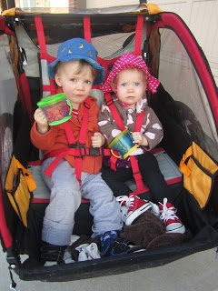
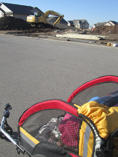
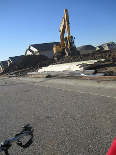

Last night wasn't an easy night. I had two young ones join me in bed and so that means that I don't get very much sleep. When my alarm went off at 5:30 I was still taking care of little A so I knew that I wouldn't get my run in. I was really disappointed but was determined to get it done at some point. I thought that would mean that I would head to the gym after they went to bed at night (I really dislike exercising that late in the day) but then it turned out to be a BEAUTIFUL February day so we all headed out with the jogging stroller after nap time. I've only used it twice and it is tough to run with the extra 45 lbs.or so. I had wanted to run 3 miles but was very happy with the 2 that I completed. One day I will be able to jog with the kids for 3 (or more!) miles but I have to work up to that.  
  
I loaded the kiddos up in the stroller, gave them a snack and away we went. They don't look very excited but they actually were excited to go running with Mommy.  
  

  

An excavator was digging the basement of a new house just down our street so we had to stop for a second and watch that. O thought that was pretty cool. 

  

  

  

It will be fun to watch the whole house go up.

  

Distance: 2.04

Time: 21.33

Pace: 10:33
