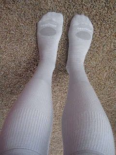

Look what came in the mail yesterday!  
  

  
  

<table align="center" cellpadding="0" cellspacing="0"><tbody><tr><td></td></tr><tr><td>A isn't very happy that I wanted to take a picture of my feet!</td></tr></tbody></table>

  

My new [Smartwool Compression socks](http://www.runningwarehouse.com/descpage-SWGCUL.html)! I have never been so excited for a pair of socks. Ever. I put them on right away and was very impressed with them. I've never worn compression socks before and after struggling to put them on I wasn't too impressed. It wasn't until after I had them on for a few minutes that my legs started to feel the socks. I really didn't want to take them off because the added support just felt amazing. I can't wait to wear these after a long run. Right now I'm going to wear them for recovery instead of during a run. I guess I bought the right socks because the day after I ordered them I read that they are the Runner's World pick for best recovery compression socks. 

  

I signed up for my 10K [SunRun](http://eastersunrun.com/) race today! I'm now officially registered for the three spring races that I chose to do this year. The first is coming up next week: [St. Patrick's Day Party and Run](http://llsrunwichita.com/) which is 4 miles. The last race is, of course, the [Wichita Johnston's Half Marathon](http://wichitahalfmarathon.com/) in April.

  

My run this afternoon was fun. Because it was an interval run and I had to think about what I was doing I didn't listen to music. My goal was to keep my fast intervals around 2 minutes. 

| 
INT | 

TIME | 

AVG.

PACE |
| --- | --- | --- |
| 1 | 0:00-2:14 | 8'53"/mi |
|  | 2:14-4:36 | 9'29"/mi |
| 2 | 4:36-6:33 | 7'48"/mi |
|  | 6:33-9:06 | 10'13"/mi |
| 3 | 9:06-11:15 | 8'36"/mi |
|  | 11:15-13:56 | 10'49"/mi |
| 4 | 13:56-16:09 | 8'50"/mi |
|  | 16:09-18:43 | 10'19"/mi |
| 5 | 18:43-20:48 | 8'20"/mi |
|  | 20:48-23:32 | 11'04"/mi |
| 6 | 23:32-25:41 | 8'35"/mi |
|  | 25:41-28:19 | 10'27"/mi |
| 7 | 28:19-30:31 | 8'54"/mi |
|  | 30:31-33:10 | 10'31"/mi |
| 8 | 33:10-35:22 | 8'49"/mi |
|  | 35:22-38:09 | 11'09"/mi |
| 9 | 38:09-40:22 | 8'52"/mi |
|  | 40:22-43:04 | 10'51"/mi |
| 10 | 43:04-45:47 | 10'54"/mi |
|  | 45:47-48:27 | 10'40"/mi |
| 11 | 48:27-50:43 | 9'34"/mi |

  
  

The first interval and the last two were warm up and cool down intervals. I was only supposed to do 7x400 m intervals but I accidentally did 8. I guess that is better than accidentally not doing enough! According to my training I wanted my fast intervals to be between 1:54 and 2:17. I was shooting for 2:00 minutes though and I was able to get below or close to 2:00 every time. Yeah! I love coming back, hooking my watch up to the computer and finding out that I accomplished what I wanted to do!

  

I ran alone at the park today instead of the gym. I loved being around other people running outside but I didn't like not knowing the park that well. My goal for the day was 5 miles but I ran 5.23 according to my watch. I thought I was pretty close to my car but I was really far from it. I started walking to cool down but then I realized how far I was and so I started jogging again. I bet I ran another half mile to 3/4 mile to get to my car. I think I'll run more often at the park, I enjoyed it a lot more than running in my neighborhood!

  

Distance: 5.23 miles

Time: 50:42

Average Pace: 9:42
