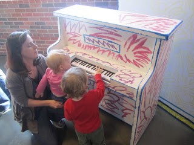
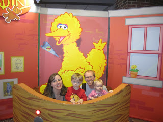

I'm halfway there! Only 6 more weeks until my next 13.1 miles.  
  
Other than running too fast on my Thursday run (goal: 10:12 actual: 9:20!) and skipping my Sunday recovery jog I kept to my plan last week really well. Most of my pace goals were met and I put in the mileage that I wanted. Thursday I didn't have very much time to get the run in so I pushed it....which felt good, even after my tough Wednesday workout. Sunday, I was just lazy, tired, maybe the time change messed with me, whatever the reason I didn't make it out there. I think it is my first skip of this training cycle.  
  
Saturday's 8 miles went o.k. I'm a little disappointed because 8 miles had been my favorite distance but Saturday it was just 8 miles, nothing special. I realized that the reason I liked 8 miles before is that at my old house I ran to the Riverside neighborhood and back to get 8 in. It was a pretty run. Saturday I had to circle my neighborhood once and then I headed out of our neighborhood after the sun came up. The road out there is pretty narrow and I don't want to run it in the dark so I waited until the drivers could see me. I liked running early in the day and I LOVED my new Saucony long sleeve shirt that came in the mail on Friday. Perfect timing for my 45 degree morning run. Running Warehouse is a dangerous thing for me! I had to get my run in early on Saturday because we had big plans for the rest of the day.  
  

  

  

  

Sesame Street Live was in town and we have two big Elmo and Super Grover fans at our house. We had a blast playing in Elmo's World and taking pictures with all the characters before the show. The kids were in awe during the show. I loved watching their faces while they were taking in all of the excitement. Oh, and the number of the day was 8...very fitting since I had just run 8 miles earlier in the day. Ahh, Ahh, Ahh!

  

Now on to the week ahead. 

  

Monday: 3 miles (easy: 10:43 pace, already done)

Tuesday: Strength

Wednesday: 4 miles pace (9:12-10:26) Shooting for under 9:50

Thursday: 3 miles easy or rest due to race on Saturday

Friday: Strength

Saturday: 4 miles RACE DAY! 

Sunday: Rest or 2-3 miles recovery jog (11:12-11:42 pace)

  

It's going to be warm here this week, temps in the 80's. Where did the 70's go????
