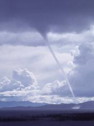
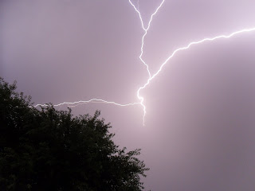

My run tonight was a little eventful. I had a little of this...

[Source](https://encrypted-tbn0.google.com/images?q=tbn:ANd9GcQ38P5XQTavuN0b6nDcg85f8HvvTOCdSu8SsVTcxmb9xpf2-0YS)

 and a little of this...  

[Source](https://encrypted-tbn2.google.com/images?q=tbn:ANd9GcTXKdk59U1EACh4r17w6YM1c_uirMltZRM-sGVGeaj0DpvgZiRNIw)

  
I did check the weather before I left (and so did my husband!) Everything looked clear but a bunch of stuff developed by the time I had driven to the park and ran for about a mile and a half.   
  
  
Let's back up a little. Usually when I run an interval workout I don't listen to music so I can concentrate on hitting a certain pace. Today I decided to listen to music because that is the only way that I will hear a phone call (coming through the ear buds) while I am running. I briefly thought about running with the headphones on with no music but that just seemed silly! I just had to listen closely (over the music) for the little beep from my watch telling me that my interval had changed. C.J. was in charge of keeping an eye on the weather in case anything developed while I was out there. I'm so glad I got his phone call because I hadn't noticed anything until he called. I looked up in the sky and saw the funnel South of me and freaked out! I was a mile and a half from the car and the car was between me and the tornado. After taking a minute to try and figure out if I head to my car or find shelter somewhere else I decided to make a run (pun intended, I guess!) for it and head to the car.  
  
  
C.J. did a little more research (I never say that sentence, do I???) and discovered that it was a cold funnel cloud (also known as a cold funnel tornado.) Not the blow you away kind of tornado that we are most familiar with here in Kansas....so that was good. Because it wasn't life threatening I started debating with myself on whether I should try to salvage my intervals but then the lightning started. I HATE lightening. It's really the one thing that will for sure keep me from running outside....well I guess I wouldn't run in hail either. But I will run in rain, snow and all sorts of other weather.   
  
  
I made it safely to my car after finishing 3.09 miles...so close to a 5K! If I had known I might have dodged a lightening bolt or two to get in the extra .01 miles.   
  
  
There is one positive from my run today. Evidently, running in bad weather leads to negative splits. My mile splits for today: 9:37, 9:23 and 8:47. 
  
  
As I drove out of the parking lot I saw several people just heading out for a run and one just going out on his bike. Did they see the lightening and just not care? I really don't get it. You gotta love Kansas in the spring.  
  
  
Distance: 3.09 miles  
Time: 28:33 minutes  
Average Pace: 9:13
