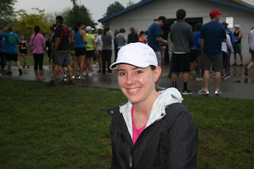
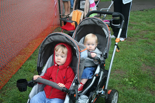
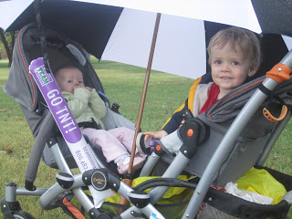
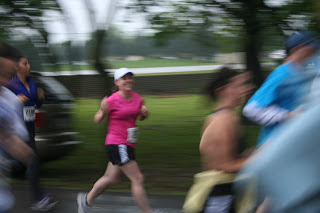
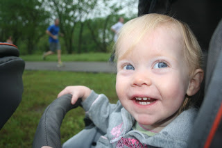
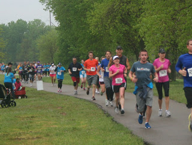
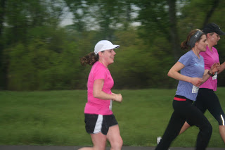
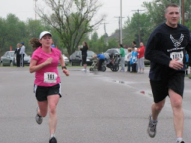

This was my first 10K race. I've discovered that 6.2 miles is a great racing distance and I already look forward to racing it again.  
  
  
We had lightening early in the morning and a downpour. Luckily for all the runners today, the lightening stopped and the rain basically quit. We were left with a gorgeous overcast day with perfect running conditions...in my book anyway. I LOVE running in high 50's/lower 60's. Even the little bit of rain felt good as it came down on us during part of the race.   

<table align="center" cellpadding="0" cellspacing="0"><tbody><tr><td></td></tr><tr><td>Ready to run!</td></tr></tbody></table>

The race was at the same park that I have been running my tempo and interval training runs. I was happy to be familiar with the path and surprised to find a couple of new paths that I hadn't run on before. What a beautiful park!  

  

Friday the Sun Run race organizers put on facebook that there were 2200 people signed up. I'm interested to see how many people actually raced the 10K.

  

I felt good all morning, although I was nervous. Making goals and pushing myself to run certain times is a little nerve racking but the challenge is definitely worth it. Especially when goals are met! Speaking of goals, for the race today I wanted to be under 56:29.

<table align="center" cellpadding="0" cellspacing="0"><tbody><tr><td></td></tr><tr><td>Waiting on Mommy. Don't we look excited??? &nbsp;:)</td></tr></tbody></table>

This is the second race that my children and my husband have come out to cheer me on when it has been raining. Last time it was the marathon...which ended up being a marathon for my husband too (two small children, one big stroller, marathon signs, mud and lots of rain!) Sometimes I think it was \*almost\* harder for him. At least this race wasn't quite as long or as rainy.  

<table align="center" cellpadding="0" cellspacing="0"><tbody><tr><td></td></tr><tr><td>Pic from my marathon last Fall. A &amp; O in the rain.</td></tr></tbody></table>

<table align="center" cellpadding="0" cellspacing="0"><tbody><tr><td></td></tr><tr><td>Another marathon pic. Just some of the signs my husband carried around.</td></tr></tbody></table>

O.K. back to this race. My plan for the race was to stick to a 9:05 pace (my goal pace) and then push it harder in the last 3 miles if I still had it in me. The gun went off and I started running.   

<table align="center" cellpadding="0" cellspacing="0"><tbody><tr><td></td></tr><tr><td>Even though it's blurry...I like this one. &nbsp;Good shot, C.J.!</td></tr></tbody></table>

My first mile pace was 8:20. Way too fast! I didn't want to burn out at the end so I had to slow it down to a manageable pace. I ended up running an average pace of about 8:43-8:47 for the entire race. It was faster than I planned but my legs felt good and so I decided to go for it.  

<table align="center" cellpadding="0" cellspacing="0"><tbody><tr><td></td></tr><tr><td>Having fun waiting on Mommy to run by.</td></tr></tbody></table>

I think I started too close to the front at the starting line. I like to start a race in the middle of the pack so I am not in the way of all of the elite runners at the front. I thought I was in the middle but I had a bunch of people passing me at the beginning of the race. It wasn't awful but it was a mind game. I had to keep telling myself that: 'It's o.k. that people are passing me. I'm not racing them, I'm racing myself. I need to stick to my goal pace and not worry about the people passing me.' Later on I made up for it by passing several people myself. ;)  

<table align="center" cellpadding="0" cellspacing="0"><tbody><tr><td></td></tr><tr><td>There she is! There's Mommy!</td></tr></tbody></table>

The race was mainly on the narrow bike path so it got a little congested a few times. There were only a couple of times where I had to wait for an opening before passing other runners.  

<table align="center" cellpadding="0" cellspacing="0"><tbody><tr><td></td></tr><tr><td>At the 4K.</td></tr></tbody></table>

  

<table align="center" cellpadding="0" cellspacing="0"><tbody><tr><td></td></tr><tr><td>'Hi O, Hi A!' (Hi to my mom and husband too!)</td></tr></tbody></table>

I never hit a point in the race where I was tired or needed to slow down. Even towards the end I felt like the pace was comfortable and I could have kept going. (Maybe this means I should have pushed myself a little more???) Overall, it was just a great race.   

<table align="center" cellpadding="0" cellspacing="0"><tbody><tr><td></td></tr><tr><td>I really need to work on my form. I'm trying really hard not to compare myself with the two other runners in the picture. :)</td></tr></tbody></table>

Here's the TMI segment to this post. After the 7K mark another woman a little ahead of me started vomiting. I immediately moved to the other side of the path and kept running. I don't handle vomit well and didn't want to get sick myself. Yeah, I felt a little bad when another lady behind me stopped with her and asked her if she was o.k. I guess I'm not very helpful when I'm on a mission! 

<table align="center" cellpadding="0" cellspacing="0"><tbody><tr><td></td></tr><tr><td>Photo Credit: The Running Connection</td></tr></tbody></table>

I couldn't be happier with these numbers below. My splits were a lot faster than I intended but I was able to keep up with my pace throughout the race. I ended up beating my goal by 1 minute and 14 seconds!  

| 
LAP | 

TIME | 

AVG.

PACE |
| --- | --- | --- |
| 1 | 8:21 | 8'19"/mi |
| 2 | 8:56 | 8'57"/mi |
| 3 | 8:54 | 8'54"/mi |
| 4 | 9:06 | 9'06"/mi |
| 5 | 8:55 | 8'55"/mi |
| 6 | 8:32 | 8'32"/mi |
| 7 | 2:31 | 8'17"/mi |

  
  
  
Also, a great big THANK YOU to my husband, my children and my mom for coming out to support me. You guys are awesome!  
  
  
Official Distance: 10K (6.2 miles)  
Nike+ Distance: 6.3 miles  
Official Time: 55:15  
Nike+ Time: 55:15  
Official Average Pace: 8:54  
Nike+ Average Pace: 8:46  
Overall Placement: 325 out of 688   
Age Division (35-40): 27 out of 75
