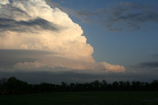
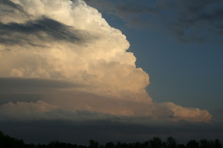
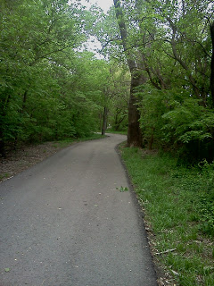
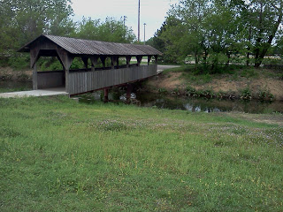
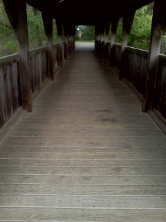
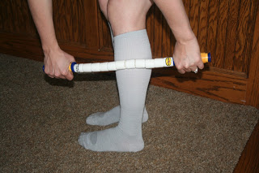

I had a week of great running. On Wednesday I had considered changing my scheduled tempo run to an interval run because my previous interval run was interrupted by the storm last week. I decided to stick with the tempo because it isn't as easy for me and therefore I need practice. I'm glad I went ahead and did it because it wasn't horrible, I actually enjoyed it and I mainly stayed within my goal range which was a 9:00 to 9:23 pace.  

I know I am improving because a couple of months ago if you would have told me that I would be running an 8:50 average pace during the last mile of an overall 9:15 pace 5 mile run I would never have believed you. I'm so happy I was able to push it at the end and give the run more instead of running out of gas. Maybe I am starting to like the tempo run....

  

Distance: 5.01 miles

Time: 46:25

Average Pace: 9:16

  

My long run this week was 11 miles and I left early to get it in before the stormy weather came to our area. 

<table align="center" cellpadding="0" cellspacing="0"><tbody><tr><td><a href="http://1.bp.blogspot.com/-hnCdLc2mOXU/T4nns_RGZdI/AAAAAAAAAdE/TMtlWFnxKv8/s1600/IMG_6167.JPG" imageanchor="1"></a></td></tr><tr><td>These are nice pretty cloud pictures that I took from our back porch last night.&nbsp;</td></tr></tbody></table>

<table align="center" cellpadding="0" cellspacing="0"><tbody><tr><td><a href="http://2.bp.blogspot.com/-Z05WqWmlyds/T4nnusbyFgI/AAAAAAAAAdM/F2XCY0H9CO0/s1600/IMG_6168.JPG" imageanchor="1"></a></td></tr><tr><td>The clouds today haven't been so friendly looking.</td></tr></tbody></table>

I left the house with an out and back planned. I ran all the way to the park where I ran a big loop and then headed back home. It's nice to break it up into smaller miles. 4 miles to the park. 3 miles inside the park. 4 miles back home. 4, 3 and 4 sound much easier than 11. 

  

Today while I was running I was thinking over my entire round of training. It's coming to an end soon and this is probably going to be my last long run to the Sedgwick County Park. I've haven't ran a lot in the park before training for this half and so that is what will stick in my head when I think of this time in my life. It's such a pretty park and I'm glad that I've gotten to know it a little better. I'm definitely going to continue running at (and to) the park on future runs.

<table align="center" cellpadding="0" cellspacing="0"><tbody><tr><td><a href="http://2.bp.blogspot.com/-BK2rSMch13w/T4nnoWj_R3I/AAAAAAAAAcs/qkzPqq7AQVY/s1600/IMG_20120414_081119.JPG" imageanchor="1"></a></td></tr><tr><td>Nice shade covered paths.</td></tr></tbody></table>

<table align="center" cellpadding="0" cellspacing="0"><tbody><tr><td><a href="http://2.bp.blogspot.com/-mtxuesS8IKc/T4nnqOHmBPI/AAAAAAAAAc0/-N6qP3gz4JI/s1600/IMG_20120414_081456.JPG" imageanchor="1"></a></td></tr><tr><td>Bridges! I love bridges.</td></tr></tbody></table>

<table align="center" cellpadding="0" cellspacing="0"><tbody><tr><td><a href="http://3.bp.blogspot.com/-9R7W7_wfnTc/T4nnrWlD3MI/AAAAAAAAAc8/r1o-rdiom_0/s1600/IMG_20120414_082015.JPG" imageanchor="1"></a></td></tr><tr><td>It gives the run a little character.</td></tr></tbody></table>

Distance: 11 Miles  

Time: 1:58:13

Average Pace: 10:45

  

Today I went to the running store with my mom so that she could get new shoes. She picked out a great pair of Nike's and I picked up a couple of things too. I knew going into the store that I was going to pick out a new sports bra. I love the brand they sell there ([Moving Comfort](http://www.amazon.com/Moving-Comfort-Womens-Juno-Grape/dp/B0058YHE1G/ref=sr_1_26?s=sporting-goods&ie=UTF8&qid=1334440017&sr=1-26)) and it is time to add a new one to my rotation. 

  

I also have learned that it's not such a good idea to go to a running store with achy legs after an 11 mile day (or maybe it is a great idea!) I walked out of there with this:

THE STICK! I tried it at the store and I didn't want to stop using it. It felt fantastic on my calves and now I can't imagine not using it after running. 

  

One final note. Yesterday we went to the store to stock up on supplies for our storm shelter in the basement. One of the best features of our new house is that it actually has a concrete shelter in the basement. Very nice for peace of mind when you live in Kansas. As we were putting all the canned goods and other processed foods into the cart I couldn't help but cringe at what we were buying. I was a little embarrassed to have all of that in our cart. We tried to make good decisions when deciding between the brands but it definitely doesn't represent how we eat on a regular basis and I guess I'm glad for that. Now I just need to decide if we end up eating it before it expires or what we will end up doing with it. I guess I have a couple of years to figure that out...
