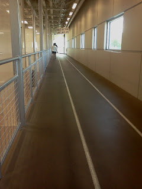
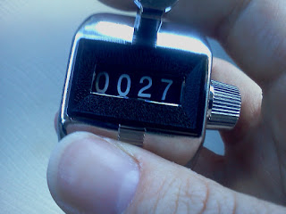

It was crazy windy outside on Sunday so I decided to take my recovery jog inside at the Y on the track.

  

I think I have finally figured out how to make running at the Y work for me! I've had a couple failed attempts ([here](http://healthymomontherun.blogspot.com/2012_02_01_archive.html#8226826931433224876) and [here](http://healthymomontherun.blogspot.com/2012_02_01_archive.html#7020895815705981091).) With a little trial and error my run today went well and I was able to get the data for my running log. First, I downloaded a stopwatch to my phone. I timed the whole run and I was able to tap the phone for each mile split. Secondly, I purchased a lap counter last week and I put it to good use today during my 27 laps around the track. It was very nice not having to constantly think about what lap I was on in order to accurately track my mileage. 

<table align="center" cellpadding="0" cellspacing="0"><tbody><tr><td><a href="http://amotherspace.net/wp-content/uploads/2012/04/IMG_20120415_1546591.jpg" imageanchor="1"></a></td></tr><tr><td>27 laps = 3 miles</td></tr></tbody></table>

My only problem was that I ran at a comfortable pace and it ended up being too fast for my scheduled recovery jog. The purpose of a recovery jog is to help shake out your legs after a hard workout the day before. Some people rest on the recovery day or some people do a cross training activity. I have chosen to do recovery jogs for this training cycle. It is important to run SLOWLY to not add any more stress to your legs. I need to work on this. I felt like I was going slowly and then I would glance down at the time and see that it was still too fast. Splits: 9:30, 9:43, 10:14

  

Distance: 3 miles

Time: 29:28

Average Pace: 9:50

  

It's Monday so here is a look back at my 10th week of training:

  

Monday

- Goal: 5 miles easy (10:24-10:54 pace)
- Actual: 5 miles @ 10:56

Tuesday

- Goal: Strength
- Actual: Strength

Wednesday

- Goal: 5 miles pace (9:00-9:23 pace)
- Actual: 5 @ 9:16

Thursday

- Goal: 3 miles easy (10:24-10:54 pace)
- Actual: 3 @ 10:35

Friday

- Goal: Strength
- Actual: Strength

Saturday

- Goal: 11 miles long (10:24-11:24 pace)
- Actual: 11 @ 10:45

Sunday

- Goal: 3 miles recovery jog (11:24-11:54)
- Actual: 3 @ 9:50

  

Here is what I have in store for week 11:

  

Monday: Rest

Tuesday: Strength and 5 miles easy (10:24-10:54 pace)

Wednesday: 10x400 Interval (average pace of 8:53-9:11 with each interval 1:56-2:03 minutes long

Thursday: 3 miles easy (10:24-10:54)

Friday: Strength

Saturday: 12 miles long (10:24-11:24)

Sunday: 2 mile recovery jog or rest
