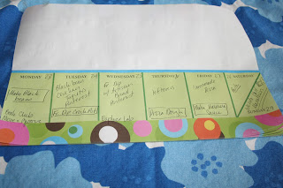

Making real food for my family requires a little bit of planning. I'm used to it because I've been planning weekly meals for years now. I have a weekly notepad on the refrigerator that I fill out before the weekly grocery store trip. It isn't that big of a step for me to look ahead at a recipe and know what needs to be done a day or two before to pull the meal together on time.   
  
  
For example, this week I knew that I wanted to use homemade BBQ sauce instead of store bought so on my planner I wrote 'make BBQ sauce' on Monday's square. The recipe made a lot more than we needed so the extra goes into the freezer ready to be defrosted the next time we want to have BBQ sauce. I also use the notepad to remind myself to take meat or other items out of the freezer to defrost, when to make marinara sauce, tortillas or any other added homemade item to help round out a meal. I've also found that it is easier to plan out two weeks in advance.  

<table align="center" cellpadding="0" cellspacing="0"><tbody><tr><td></td></tr><tr><td>A look ahead at next week... </td></tr></tbody></table>

I have also learned that even though I have a meal plan I need to be flexible. For the week below I had planned Cabbage Rolls for dinner on Thursday night. We ended up having so many leftovers during the week that I went ahead and made it but instead of serving it for dinner I stuck it in the freezer for later. We had the Senate Soup a lot this week. It was really good and no one minded having it for several meals. (Little O LOVES ham!) When I made it I doubled the recipe and ended up freezing 5 big baggies of it for lunches or dinners later on.  

  

**Meal Plan: April 15-21, 2012**  
  
Sunday  
Chicken Pasta Leftovers with Alfredo Sauce  
  
  
Monday  
Senate Bean Soup (from my Betty Crocker cookbook. I couldn't find it online to add a link)  
[Homemade "Easy Little Bread"](http://www.101cookbooks.com/archives/easy-little-bread-recipe.html)   
  
  
Tuesday  
Leftover Senate Soup and Bread  
  
  
Wednesday  
[Monterey Chicken](http://fullbellies.blogspot.com/2006/11/monterey-chicken.html) with [homemade BBQ Sauce](http://onceamonthmom.com/homemade-bbq-sauce/)  
Sauteed Asparagus  
Oven Fries (using up the last of the freezer fries!)  
  
  
Thursday  
Leftover Senate Soup and Bread  
Raw Carrot Sticks  
Blackberries and Apples  
  
  
Friday  
Leftover Monterey Chicken  
  
  
Saturday  
Out of Town, Dinner at an event  
BBQ Sandwiches  
Mac & Cheese  
Cheesy Potatoes   
Pickle  
  
  
Sunday  
Baked Salmon   
Roasted Cauliflower and Cabbage  
Edamame   
Peaches  
  
  
Breakfasts  
Banana Oatmeal for me  
Mom's Best Wheatfuls and Honey O's for kids and husband  
Raisin, Date and Walnut Quaker Oats for kids  
Bananas  
Pancakes (at Nana & Papa's house)  
Scrambled Eggs with Garden Spinach & other yummy veggies (at Nana & Papa's house)  
  
  
Lunches  
Turkey and Cheese Sandwich or Lettuce Wrap  
Ham and Cheese for the kids  
Grapes, Apple, Strawberries and Blackberries  
Cottage Cheese  
Stroganoff (at Nana Re's house)  
  
  
Snacks  
Nut mix: cashews, pumpkin seeds and dried apricots  
PB&Banana Sandwich (one day we had a few surprise chocolate chips in it!)  
[Whole Wheat Muffins](http://www.100daysofrealfood.com/2010/05/12/recipe-fruit-nut-or-berry-or-whatever-you-want-them-to-be-whole-wheat-muffins/)
