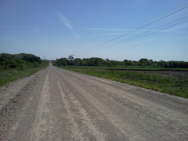
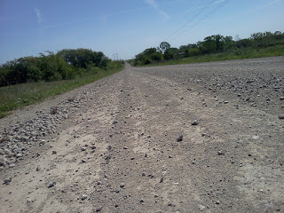
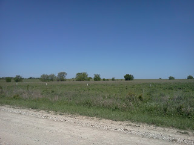
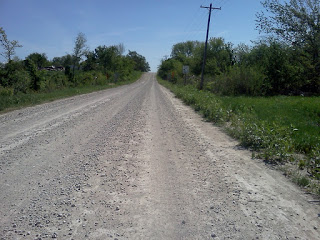
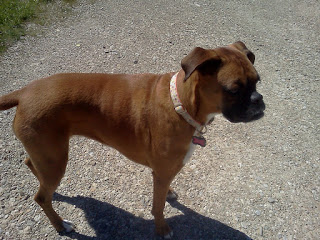

 My recovery jog this week was a new experience...running on gravel roads.   

 I liked it. It had a nice bounce to it that I'm not used to when I typically run on the street or a sidewalk. I just had to watch out for the big rocks.  

 It was a nice and easy two miles. I ran by fields,   

 up a couple of rolling hills   

And I was welcomed home by Mika....she just wishes that she could have gone with me!  
  
Distance: 2 miles  
Time: 22:08  
Average Pace: 11:01  
  
  
  

\------------------

  

Find A Mother's Pace on...  
  
Twitter [@amotherpace3](https://twitter.com/amotherspace3)  
  
Facebook [http://facebook.com/amotherspace3](http://facebook.com/amotherspace3)   
  
Instagram [amotherspace](http://instagram.com/amotherspace)  
  
  

  

RSS [amotherspace](http://feeds.feedburner.com/amotherspace)
