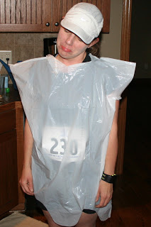
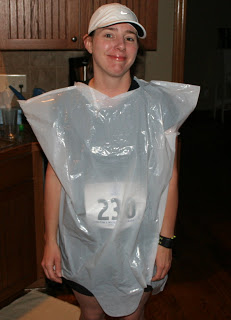
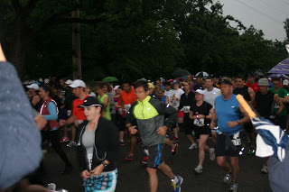
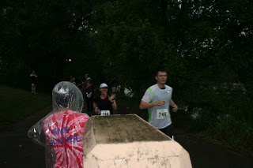
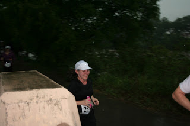
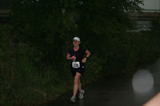
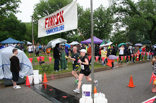
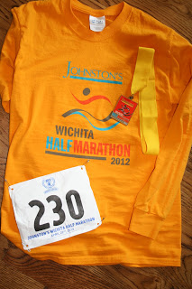

Yesterday was beautiful. Low 60's, gentle breeze, a few clouds in the sky. A perfect race day. Unfortunately the race was this morning and not yesterday! This morning I woke up to this:  

and this:

  

  

on facebook. 

  

Lightning and hail were predicted but the Race was on and I was going to run in it. (I NEVER run in lightning...I guess I can't say that anymore...)

<table align="center" cellpadding="0" cellspacing="0"><tbody><tr><td><a href="http://3.bp.blogspot.com/-tvKbb5N7ujI/T52T02C2SdI/AAAAAAAAAgo/-egKgnxlf1k/s1600/IMG_6234.JPG" imageanchor="1"></a></td></tr><tr><td>Not happy about the predicted lightning.&nbsp;</td></tr></tbody></table>

I didn't want them to cancel the race. I wanted to run. I had trained hard and was ready. I was just upset about the lightning. Rain I can handle... downpours don't make me happy but they are doable. 

<table align="center" cellpadding="0" cellspacing="0"><tbody><tr><td><a href="http://3.bp.blogspot.com/-IChNL0t639c/T52T1hDWdeI/AAAAAAAAAgw/61454D0HrqA/s1600/IMG_6235.JPG" imageanchor="1"></a></td></tr><tr><td>Happy that Race Day is here!</td></tr></tbody></table>

The kids stayed home with Grandma and C.J. and I headed out to the beautiful Riverside area. For a good portion of my adult life I called the Riverside neighborhood home. I love running in that area and was very excited to run another race in an area that is very familiar to me.   

  

I was happy to find shelter from the rain at the Team In Training tent before the race. It helped me to stay dry until just before the race and I didn't even need to wear my trash bag!

  

Heard from the megaphone before the race starts: 

- Runners are responsible for themselves once the race begins. We are not responsible for the lightning. (I'm glad C.J. told me about that one later...that wouldn't have helped my confidence at that point!)
- 30 seconds to Race Start...let's just go ahead and start now... (Too bad more races don't start early!)

And we're off.

  

I felt great at the beginning. I was paying attention to the neighborhood. Trying not to think about how beautiful it would look on a clear day. At this point it was just a light rain and felt cooling. Maybe even a little pleasant. The first few miles I held a great pace and I was starting to think that I might meet my (very challenging and not realistic) goal of breaking the two hour time. (8:42, 9:08, 9:02, 9:02)

  

I heard thunder around mile 3 and the rain started to pick up. 

  

My cheering squad was around mile 5. (C.J., Kristie and Lamont all came out to support me!)

<table align="center" cellpadding="0" cellspacing="0"><tbody><tr><td><a href="http://3.bp.blogspot.com/-VJ0EDXAwUJ4/T52Ttbd2V4I/AAAAAAAAAgI/l3kQ3dJBo-0/s1600/IMG_6245.JPG" imageanchor="1"></a></td></tr><tr><td>So happy to see some familiar faces!</td></tr></tbody></table>

<table align="center" cellpadding="0" cellspacing="0"><tbody><tr><td><a href="http://1.bp.blogspot.com/-Sj_ZAbJKXJs/T52Tu843nTI/AAAAAAAAAgQ/JFAZYJEQIgw/s1600/IMG_6246.JPG" imageanchor="1"></a></td></tr><tr><td>Yep, we were all drenched!</td></tr></tbody></table>

Then it started to get a little tough. Even though I was trying to stay out of the puddles as much as I could my feet were sloshing around in my shoes. I was trying not to think of the awful blisters that I was going to have. (I didn't end up having ANY blisters but my feet were very wrinkly after the race!) The rain was coming down very heavily by this point. It was definitely not light and pleasant anymore. There was more thunder and a little lightning. I was amazed at all the people running in the cotton long sleeve race day shirt that was provided. I can't imagine how heavy the shirt would feel after being saturated. Yuck! My clothes were soaked and it wasn't comfortable by any means but I didn't feel like it weighed me down that much. My water logged shoes were a lot more heavy and distracting for me than the clothing that I wore. (9:13, 9:13, 9:43, 9:44)

<table align="center" cellpadding="0" cellspacing="0"><tbody><tr><td><a href="http://2.bp.blogspot.com/--tnLcPWhCJo/T52TwwjNOhI/AAAAAAAAAgY/rkT7l7BPXHs/s1600/IMG_6250.JPG" imageanchor="1"></a></td></tr><tr><td>Mile 8</td></tr></tbody></table>

Mile 8 was tough. My legs were fine, it was my head that was tired. The rain was wearing on me. I only smiled for my mile 8 photo because I saw C.J. with the camera. I was not a happy runner at this point. My mantra over and over during this race was "My body is ready for this, I can do this." I had read earlier in the week a selection from "[Train Like a Mother](http://www.amazon.com/Train-Like-Mother-Across-Finish/dp/1449409865/ref=sr_1_1?ie=UTF8&qid=1335729067&sr=8-1)" by Dimity McDowell and Sara Bowen Shea that stuck with me. In it they talked about how your body is ready after training but the hard part is getting over your mind struggling to finish. So true.   

  

The last few miles were hard for me. I had slowed down a lot. I decided that I needed to walk through the the last two water stations for Gaterade to help give me a little bit of a kick. My hopes for running under two hours were dashed. My next goal was to run under a 9:23 average pace. My watch kept climbing. Then I was determined to not pass the 9:30 pace. I was so close to finishing and I just needed to hold on. (9:53, 10:07, 9:57, 10:07, 9:58)

  

My average pace ended up at 9:30. Not what I was hoping for but with the conditions at hand I am still pretty happy with it. It was a huge PR for me. A 12 minute PR over my last half in the Fall. I'll just have to train to beat the 2 hour barrier next time around!

<table align="center" cellpadding="0" cellspacing="0"><tbody><tr><td><a href="http://1.bp.blogspot.com/-dE4v-7vq1zI/T52T0OXMWwI/AAAAAAAAAgg/VY50Zb3p_oA/s1600/IMG_6251.JPG" imageanchor="1"></a></td></tr><tr><td>Done!</td></tr></tbody></table>

Oh yeah, and I totally chicked that man by passing him right at the end. I had no idea that I even passed anyone until I saw this picture!  

  

Official Distance: 13.1 miles

Nike+ Distance:13.08 miles

Official Time: 2:04:33

Nike+ Time: 2:04:33

Average Pace: 9:30  
  
  
Place: 458 out of 923  
Gender and Age Grade (35-40): 44 out of 103  

  

