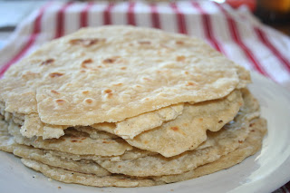

  
  
It turns out that tortillas are very easy to make! The only (minor) setback was a smoke filled house causing the very loud smoke alarm to go off. I started off with the heat too high on the pan and it made a lot of smoke! Overall everything was much easier than I anticipated. They are delicious too! Both O & A have enjoyed them for a snack this week.   
  
  
This week I also made a batch of granola\*, Wheatberry and Quinoa Salad, and a big batch of dried black beans for the freezer.  
  
  
The Cabbage Rolls turned out o.k. but were lacking in flavor. I love the idea of Cabbage Rolls but in the future I would make them with a different meat...like Italian Sausage to give it a little more taste. We are adding cheese to the leftovers to make it work a little better for us. Also, the flavors had more time to mix together when we ate them as leftovers and they were much better the second time around.  
  
  
**Meal Plan: April 23-29, 2012**  
  
Monday  
[Cabbage Rolls](http://onceamonthmom.com/whole-foods-grand-moms-galumpkis/)  
Cauliflower  
Peaches  
  
  
Tuesday  
[Chicken and Black Bean Taquitos with Homemade Tortillas](http://blogs.babble.com/family-kitchen/2011/03/26/black-bean-chicken-taquitos/)  
Frozen Corn  
Strawberries  
  
  
Wednesday  
Cabbage Roll Leftovers  
  
  
Thursday  
Taquito Leftovers  
  
  
Friday  
Homemade Garlic, Onion and Tomato Pizza  
Fruit   
  
  
Saturday  
Pasta with [Homemade Marinara Sauce](http://onceamonthmom.com/marinara-sauce-a-la-seaton/)  
Cabbage & Cauliflower  
Fruit  
  
  
Sunday  
[French Dip](http://onceamonthmom.com/slow-cooker-french-dip/)  
Mango, Blackberries, Blueberries  
Asparagus  
  
  
Breakfasts  
Mom's Best Honey O's  
Mom's Best Wheatfuls  
Banana Oatmeal with Granola  
  
  
Lunches  
Grilled Cheese Sandwiches  
Wheatberry and Quinoa Salad  
Grapes, Blackberries  
Turkey and Cheese Sandwiches or Lettuce Wraps  
  
  
Snacks  
Tortillas with peanut butter and honey  
Goldfish Crackers (finishing out the last bag!)  
Raisins  
Granola  
  
  
  
  
\*Recipes may be found on my [Real Food Recipes and Links](http://healthymomontherun.blogspot.com/p/real-food-recipes-links.html) page.
