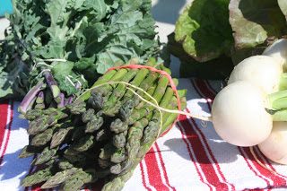

<table align="center" cellpadding="0" cellspacing="0"><tbody><tr><td><a href="http://2.bp.blogspot.com/-zzn9nOlxKxY/T6A1JNotJJI/AAAAAAAAAhU/KMQ_aynQnh4/s1600/IMG_6232.JPG" imageanchor="1"></a></td></tr><tr><td>Kale, Asparagus, Lettuce &amp; Turnips</td></tr></tbody></table>

Last weekend we went to the Farmer's Market for the first time this season. We took the kids and enjoyed walking around and looking at all the fresh produce, bakery items, crafts, plants and of course people watching. We always do one loop through to scope things out and then on our way back around we decide what we will purchase. This week we bought kale, asparagus, lettuce, turnips and a beautiful lantana plant for our side garden. The asparagus was amazing! C.J. sauteed it and we ate it with the original French Dip dinner. I love when asparagus is in season. It's fun to set a meal plan up the afternoon after going to a Farmer's Market...dreaming up different ideas for all of the 'finds' at the market. Our new routine might just have to include the Saturday morning Farmer's Market visit followed by Saturday afternoon meal planning and then finished with grocery shopping for the rest of the weekly supplies on Sunday.  

**Meal Plan: April 30 - May 6, 2012**

Monday

French Dip Leftovers

Blueberries

  

Tuesday

[Kale Frittata](http://inspiredrd.com/2012/03/frittata-with-kale-and-purple-potatoes.html) (Farmer's Market Kale & Turnips)  
Fruit  
  
  
Wednesday  
Leftovers  
Sauteed Kale  
  
  
Thursday  
[Tilapia Tacos](http://www.tasteofhome.com/recipes/Tilapia-Tostadas) with [Homemade Tortillas](http://onceamonthmom.com/homemade-flour-tortillas-recipe/)  
Oranges & Kiwi  
  
  
Friday  
[Easy Garlic Chicken](http://www.food.com/recipe/easy-garlic-chicken-5478)  
Frozen Green Beans  
Blackberries, Strawberries, Kiwi  
Cottage Cheese  
Artisan Bread

  

Breakfasts

Mom's Best Toasty O's

Banana Oatmeal  
  

Lunches

Leftover French Dip

Leftover Bean & Chicken from Taquitos in Lettuce Wrap

Turkey and Cheese

Grapes, Apple

Peanut Butter & Jelly  
  

Snacks

Granola

Raisins  
Goldfish Crackers (that box is never ending!)  
Greek Yogurt
