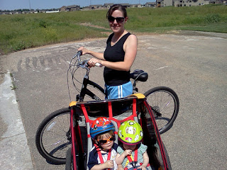
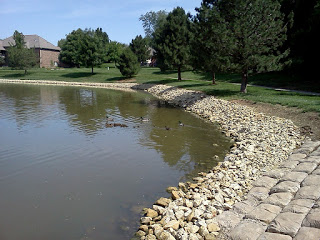
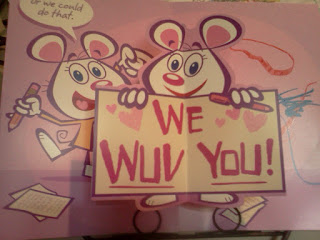

Life is busy. Blogging about busy life and running sometimes takes a back seat to real life! That said, I really want to write about Mother's Day this year even if it is almost two weeks after the fact.  
  
  
Being a mother is the most important thing in my life. I am blessed to have two amazing children. I'm a stay at home mom and love spending these precious moments with my young children. I spent Mother's Day celebrating my two sweet reasons that I am a mother and that made the day very special for me.   
  
  
We took advantage of the gorgeous weather and headed out for a bike ride.  

This was the first time in a long time that I haven't pulled the trailer. It's amazing how easy it is to ride a bike without all that weight behind me!

  

We saw a couple of mommy ducks and their ducklings.

Little A fell asleep in the trailer and didn't look comfortable at all so we headed home a little early. Not to worry...we got more exercise in later in the day.

  

Riding my bike wasn't the only fun workout I was able to squeeze into the day. In fact, I think I did all of my favorite workouts in one day! We went for a walk with our dog, I ran while the kids were napping and I even managed to do a strength workout.

My kids made wonderful signatures on my card. Little A 'wrote' her name in blue. Little O wrote his O all by himself in red. This card is a keeper for sure!

  

We finished off a perfect day with dinner with my mom and brother out on the deck. My husband grilled a fantastic meal--steak with delicious stuffed portobello mushrooms and corn on the cob on the side. What a beautiful day!
