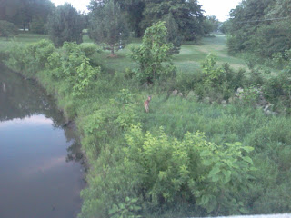

I've seen some wildlife while running. Before this week my favorite was a large blue heron. That was before spooking a deer during my early morning run.  

He was originally under the bridge that I ran over. We both scared each other at first...he shot out from under the bridge right by me. I wasn't expecting that big of an animal so close to me. I had to stop. I took several very blurry pictures with my phone but this one actually came out pretty clear.

  

This run was special. Not only did I see a spectacular deer but I felt great while running and (most importantly!) I ran negative splits!

  

I didn't set out to try for a negative split run but once I started and realized how great I was feeling I decided to go for it. Even _after_ I was finished with my run I was feeling so great that I decided to add a few strides to wrap things up. My plan called for 6 miles but I threw in 3 100 meter strides at the end. I'm loving strides right now. It's a great way to learn to give a little push at the end of a race and it's a fun way to do a small amount a speed work. 

  

I wish all runs went like this one!

  

Distance: 6.45

Time: 1:03:07

Average Pace: 9:47
