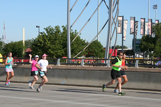
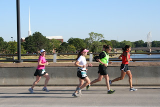
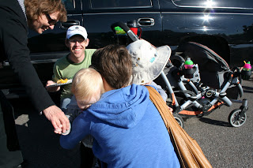
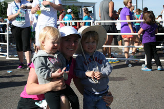
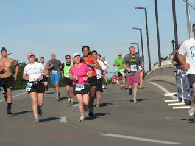

Today was one of those (very) rare days where everything comes together on a race day. The weather was perfect (55 degrees in June in Kansas?!?), my legs felt great, my Nike+ watch worked and I now have a new 10K PR. 

  

<table align="center" cellpadding="0" cellspacing="0"><tbody><tr><td></td></tr><tr><td>My sister and I (and the kids in the stroller) before the race.&nbsp;</td></tr></tbody></table>

Because my watch didn't work during my race last weekend (race recap from that 5K will be posted tomorrow morning) I decided I needed a back up. I installed RunKeeper on my phone and brought along my head phones (to listen for pace updates), just in case. I don't typically listen to music during a race because I like to concentrate and enjoy my surroundings so I'm not used to having my headphones on during a race. I really wanted my watch to work (of course) so that I could pass my phone and headphones off to my husband. 

  

I'm happy to say that my watch started just fine but my big pre-race problem was that I forgot my water bottle in the stroller. I have started always carrying water during a race so I don't have to slow down for the water stops. I sent a couple of worried texts to my husband and sister and hoped that I would run past them for the hand off. 

  

I was mainly looking on the left side of the road and then I noticed that they were looking for me from the _right_ side. I dodged in front of some not too happy with me racers, passed my phone and headphones to C.J. and grabbed my water bottle from my sister. Success!

  

  

The course was beautiful and aside from a few rough streets it was a nice, easy, flat run. The course took me through my old neighborhood and even directly past one of my old apartments. I really tried to pay attention to my surroundings and enjoy the beautiful day. 

  

  

I felt great during the race. Usually at some point during a race I am questioning why I signed up for the race in the first place. Today I ran faster than I had planned on from the beginning and never felt tired during the race. If you take away my very first mile I did a negative split race. It was just a fun race! I only wish I would have pushed it a little more at the end because I was still feeling so well. :)

  

I also saw a few spectators that I new on the race course. It always gives me a little extra pep when I see someone I know. 

  

Apparently, the balloons over the finish line deflated and so I had no idea that I was about to finish until I was just about over the chip timer. 

  

My goal for the race was to PR. My current 10K PR time was 55:15. In order to PR I would have to run a pace under 8:53. I clocked in at 53:49 with an average pace of 8:41. New PR!

  

  

We all had to say goodbye to Aunt Sara. She was headed home to Chicago right after the race. We will miss her bunches!

My favorite spectators! They were such troopers throughout the morning. Getting up early and eating breakfast on the go are definitely not in our usual routine! A is holding my medal. She thought it was a pretty necklace!

  

  

Official Distance: 10K (6.2 miles)

Nike+ Distance: 6.27 miles

Official Time: 53:49

Nike+ Time: 53:48

Official Average Pace: 8:41

Nike+ Average Pace: 8:35

Placement: 571 out of 1686

Age Placement (35-39): 27 out of 140

  

<table align="center" cellpadding="0" cellspacing="0"><tbody><tr><td></td></tr><tr><td>Photo Credit: Running Connection</td></tr></tbody></table>
