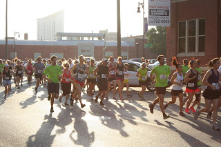
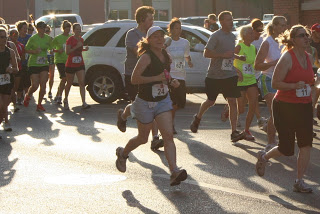
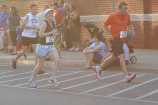
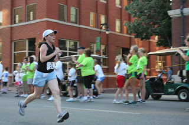

Just imagine that today is last Monday. That's when I started writing this post and when I wanted it to go out on the blog. Let's just say it's been a busy week...  
  
  
Smash that P(B)R!  
  
  
Yesterday afternoon (update...last Sunday) my older brother was attempting to give me a pep talk a couple of hours before the race. Something about there is no trying...Yoda, Yoda, Yoda. I really didn't see where he was going with it. Then he switched gears and he told me to smash my PR. That later turned into smash that P(B)R and he told me to visualize stomping on the cans while running if I really needed to kick it up a notch. The beer pep talk definitely worked much better than Yoda.  

<table align="center" cellpadding="0" cellspacing="0"><tbody><tr><td><a href="http://3.bp.blogspot.com/-mfKf8K5sWZ8/T8jN5XT25FI/AAAAAAAAAjc/DsEIm_MlBdI/s1600/FireShot+Screen+Capture+%23011+-+'Events_+List_+2012_+Wichita,+KS+2012_+Sponsors+_+Get+Your+Rear+In+Gear'+-+www_getyourrearingear_com_events_list_2012_wichita-ks-2012_sp.png" imageanchor="1"></a></td></tr><tr><td><a href="http://www.getyourrearingear.com/events/list/2012/wichita-ks-2012/sponsors/" target="_blank">Sourc</a>e</td></tr></tbody></table>

Get Your Rear in Gear is an evening race that happens annually on the Sunday of Memorial Day weekend. Last year it was HOT. This year it was warm and definitely not ideal race temperature but it wasn't in the mid to upper 90's like last year. A lot has happened since my race last year. A year ago I ran GYRIG after running two or three times to 'train' for the race. My youngest was 6 months old and I still really hadn't gotten back into running after she was born. That race changed me. It was hard because I was so out of shape and it was hard because it was so hot but I had that runner's high after the race and starting thinking of something big. Marathon big. It was a year ago that I decided to run my first marathon, which I completed with Team in Training last October. Since last May I have completed a variety of races: 1 marathon, 2 half marathons, a 10K, a 4 miler, a few 5K's and I have learned so much about running. I have grown to love it more this year and can't imagine my life without it right now.  
  
  
Back to the race. Lately I'm always nervous before a race. I have specific goals and I am nervous that I won't meet them. Today I had my Plan A Goal: 26:36 (an 8:34 pace) and my Plan B Goal was anything under 25 minutes (at most an 8:03 pace.) I usually run in the morning and so the high temperatures added to my nervousness but I knew I would at least beat my PR from 2008 (31:57.)  
  
  
The race started. I crossed the chip mat, clicked my Nike+ watch and NOTHING! The screen went blank. AGAIN. Remember back in [March](http://healthymomontherun.blogspot.com/2012_03_01_archive.html#6051035570580026733)? I've become a pace addict. I look down at my watch a lot. I depend on it to tell me I'm on track. I knew that because it was so hot during the race that it would be very hard to judge how fast I was going...everything seems harder in the heat.   

That's me, way off to the left in the blue shorts, looking down at my watch in disbelief. What are the chances that it wouldn't work on race day twice in just a few months?

  

So I just took off. I ran, it was hot, I tried my hardest. The race course is two loops in the downtown area. I didn't remember this (from last year) until just before the loop and unfortunately the race course wasn't mile marked. I'm complaining again, I know. But...it makes for a super challenging race (mentally and physically) when you are used to knowing the exact distance and pace at any point while running. 

<table align="center" cellpadding="0" cellspacing="0"><tbody><tr><td><a href="http://3.bp.blogspot.com/-UvCWeL1gsNs/T8jK2RltIrI/AAAAAAAAAjA/LJt3mSVUBUw/s1600/IMG_6416.JPG" imageanchor="1"></a></td></tr><tr><td>Half way there! Just starting the second loop.</td></tr></tbody></table>

I had the best spectators! C.J.'s family had a team in honor of a family member that is currently battling colon cancer. They had a big group both running and spectating. My dad, step mom and of course C.J. and the kids were there too. 

  

Many times throughout the race my mind went back to the pep talk from my brother. It made me smile to think of smashing my P(B)R but when I tried to picture stomping on the cans it made me feel like I had to slow down. :)

  

  

  

I tried to give it a strong finish after a difficult race. I ended up with a new PR and meeting one of my pre-race goals. 

  

  

Distance: 5K (3.1 miles)

Time: 26:15

Average Pace: 8:29

Overall Placement: 90 out of 511

Age Group Placement: 5 out of 29
