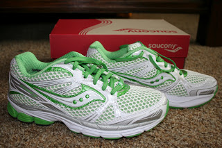

I couldn't be more excited about my purchase today. My new [Saucony Ride 5](http://www.saucony.com/store/SiteController/saucony/productdetails?catId=cat10002&subCatId=cat1220398&showDefaultOption=true&stockNumber=10156-4&skuId=***4********10156-4*M100&productId=4-109700&&subCatId=cat1220398&productId=4-109700&stockNumber=10156-4&subCatTabId=&catId=cat10002&productdisplayName=Women's+Ride+5&subcatdisplayName=Running&skuId=***4********10156-4*M100&pageIdentifier=productdetail&catdisplayName=Women&showDefaultOption=true)'s! Saucony has been my favorite shoe for the past year and I'm looking forward to breaking in my new rides this week. I have just over 400 miles on my current pair of shoes so I'll slowly work these into the rotation until my other shoes reach 500. 

  

This week it hit me. If I do want to train for a fall marathon it starts NOW! The fall just seems so far away and it felt like I would have a longer training break in between races. I haven't made any specific plans to run 26.2 in the fall but I am toying with the idea of starting to train just in case. After my last marathon I thought I would never do one again. I had accomplished my goal distance and I was done. One marathon. Done. Or so I thought. Now I know I can train better and run a better race. Doing another marathon when I can race it instead of just finishing it is an exciting challenge.

  

So, I made a plan. (You know, just in case...)

  

I developed my own training plan by combining two different plans. I used Hal Higdon's Novice 2 Full Marathon plan and added in strides, 'strong finishes,' and  'mid long run race paces' from "[Train Like a Mother](http://www.amazon.com/Train-Like-Mother-Across-Finish/dp/1449409865/ref=sr_1_1?ie=UTF8&qid=1339527472&sr=8-1&keywords=train+like+a+mother)" by Dimity McDowell and Sarah Bowen Shea. For my half this spring I had combined Hal Higdon's [Novice 2](http://www.halhigdon.com/training/51312/Half-Marathon-Novice-2-Training-Program) and his [Intermediate](http://www.halhigdon.com/training/51132/Half-Marathon-Intermediate-Training-Program) plan and it provided me with speed work and lengthy runs to get me into shape for the race. I PR'd by 12 minutes only 7 months after my last half. Hal didn't disappoint me.

  

This time around when I was looking for added speed work in between his two programs I just didn't feel like the two plans mixed well together. I liked the overall structure of the [Novice 2](http://www.halhigdon.com/training/51138/Marathon-Novice-2-Training-Program) (distance of runs, amount of running and the long run on Saturday) but I felt like I wanted _a little_ speed work. I know that marathon training isn't the best time to work on your speed but I feel like I am improving and I don't want to lose what I have gained. 

<table align="center" cellpadding="0" cellspacing="0"><tbody><tr><td></td></tr><tr><td><a href="http://anothermotherrunner.com/buy-it/" target="_blank">anothermotherrunner.com</a></td></tr></tbody></table>

The "Train Like a Mother" overall plan looks pretty complicated but I do like how they utilize strides, strong finishes and mid long run race paces. If I am up to it I will add in a couple of those each week to add difficulty to my plan. 

  

Week 1: Wichita Prairie Fire Marathon Training

  

Monday: Strength

Tuesday: 3 miles easy (10:17 to 10: 47)

Wednesday: 5 miles pace (8:53-9:16)

Thursday: 3 miles easy (10:17 to 10:47) and Strength

Friday: rest

Saturday: 8 miles long (10:17 to 11:17) with 10 minute Strong Finish

Sunday: 2-3 miles recovery jog (11:17 to 11:47)

  

I ran my first 3 miles of my training plan this morning. Since it is light outside by 5:45/6:00 when I am running in the morning I have decided to find new routes. The same 3 miles over and over in my neighborhood are getting a little old. I feel more comfortable running on narrower streets to get out of my neighborhood when it is light outside. It made the entire run go by pretty quickly and I enjoyed the nice cool breeze of the early morning. 

  

Distance: 3.16 miles

Time: 30:02

Average Pace: 9:31

  

So, even if I don't end up running in the race it is still great motivation to get me out of bed early 5 times a week!
