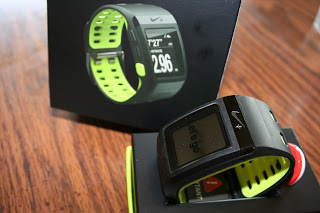

I was a little frustrated today when the doorbell rang and woke up my daughter. That was, until I realized that my replacement Nike+ Sport Watch had arrived. (And it was just about time for A to wake up anyway.) 

  

For a little over a week I have been relying on Runkeeper and my GPS on my phone while my watch has been out of commission. (It froze and wouldn't do anything. Nike+ support is wonderful and offered to send me a new one right away!) The main problem with using Runkeeper is that the GPS on my phone isn't accurate at all. I track the run with Runkeeper and then end up changing the route on the computer at home to get the right mileage. 

  

Am I obsessed with numbers if I need to have accurate documented mileage??? (probably) Will I take the time to call Nike+ customer service and have them add the Runkeeper 22+ miles to my Nike account??? (probably...yes)

  

I'm so glad that I don't have to waste my time making the Runkeeper program work for me and now I can use my watch again. 

  

I'm running 8 miles tomorrow morning so it came at the perfect time.

  

Yesterday was my first double run day! I've been wanting to try this for awhile and when I woke up and ran 5 miles I thought I was finished for the day. Later on in the day I was invited to run with my two sister-in-laws in the evening. It was too tempting to turn down. We ran a nice and easy 3+ miles together. It was so nice to run with conversation as a distraction. 

  

I wore my new Saucony Ride 5's for the first time last night. They felt light and so comfortable. I am liking the upgrades that they made with the 5's. I plan on wearing my 4's for awhile still so I hope it's not too hard to go back and forth between the two!
