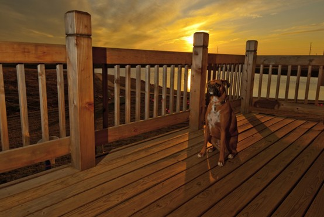
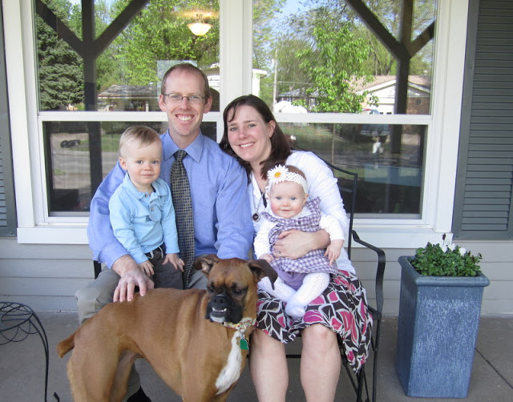
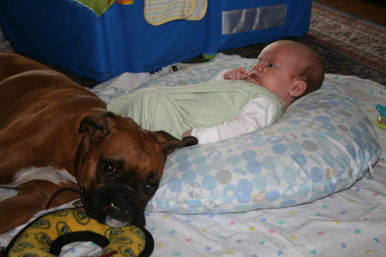
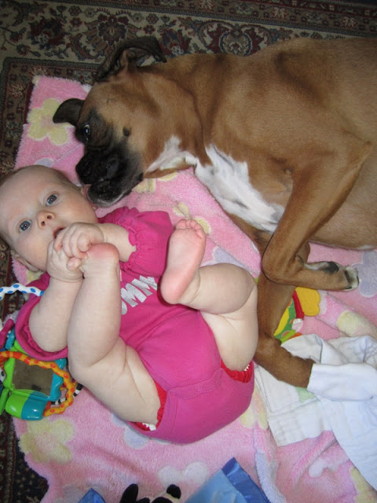

My last post was over two months ago. Needless to say life has happened and my training plans have been highly altered.   
  

<table align="center" cellpadding="0" cellspacing="0"><tbody><tr><td><a href="http://amotherspace.net/wp-content/uploads/2012/09/SunsetMika1.jpg" imageanchor="1"></a></td></tr><tr><td>Photo Credit: Photogenic Chicago</td></tr></tbody></table>

My last post happened on the day my dog, Mika, died. That evening (after my post went out) Mika and I set out for a walk and Mika didn't come home with me. We think she had a heart attack or a seizure. She wasn't even 5 years old yet. She was my baby.   
  
  

Definitely a huge part of our family.   
  
  

  
She was my first dog (unless you count my dog Spot...I was under 5 years old and really don't remember him except for pictures) and we are so heartbroken that it is difficult to imagine adding another dog to our family. I watch videos and see the joy that Mika gave the kids (and grown-ups!) and it makes me think maybe...someday...we'll have another one. Right now we are adjusting to a quieter house and remembering the special moments that we had with our Mika.  
  
  

  
She was wonderful with the kids. She didn't quite know what to think when Little O was born but she loved him right away and was very protective.  
  
  

When Little A came along she adjusted even more quickly. I never would have guessed that our VERY hyper dog would be so great around little babies.   
So, I was (am) sad. I was still running but I didn't want to write about running while I was sad. Then my running habits changed drastically.   
  
  

I discovered that first trimester running is TOUGH! Yes, we are adding to our family. Baby #3 is due at the end of February. I've never continued running while pregnant but this time around I decided that I wanted to try it for as long as I could. The first few weeks were great and then the tiredness and nausea set in. Waking up at 5:30 to get a run in before my husband went to work was not an option. I quickly went from running 5 days a week to 1 maybe 2 days. And my pace...my pace slowed way down, right away! I was surprised. I went from running around a 9 something average pace to a 10:30 to 11:30 and sometimes even 12 something average pace.   
Now I'm in the second trimester and I'm feeling a bit better. Instead of running my planned marathon in October, I've signed up for a 5K in the same race series. I'm hoping this gives me the motivation to wake up in the morning. I'm not sleeping well between 4:00 and 6:00 so I might as well get out of bed anyway, right? My goals for running are completely different during pregnancy. My first priority is the baby. I want to run to be healthy for my baby. I'm hoping that being more in shape at the time of delivery will help with labor and with recovery after the baby is born. I'm no longer running for a specific distance but instead for a time. Most days I head out and plan to run for 30 minutes. I try not to look at my pace and just run at a comfortable level. Now that I'm hoping to run a bit more regularly I will add a 'long' run during the weekend and just up the time to 40 or 50 minutes, depending on how I am feeling that day.   
Both the loss of life and adding a new life are emotional times and I'm so glad that I have running to help balance out my feelings. It's amazing how much _thinking_ time I have during a run and how much that helps me to process what is going on in my life on a daily basis.   
   

\--------------------

  
Find A Mother's Pace on...  
  
Twitter [@amotherspace3](https://twitter.com/amotherspace3)  
  
Facebook [amotherspace3](http://facebook.com/amotherspace3)  
  
Instagram [amotherspace](http://instagram.com/amotherspace)  
  
Pinterest [amotherspace](http://pinterest.com/amotherspace/)  
  
Bloglovin' [A Mother's Pace](http://www.bloglovin.com/en/blog/6680087)  
  

  

  
RSS [amotherspace](http://feeds.feedburner.com/amotherspace)
