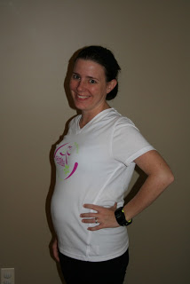

Can 4 miles be considered a long run? 

  

Definitely! Especially because lately my running is usually around 2.5 to 3 miles and not as often as I would like.

  

<table align="center" cellpadding="0" cellspacing="0"><tbody><tr><td></td></tr><tr><td>16 Weeks Pregnant</td></tr></tbody></table>

My _Long Run_ was fantastic today. It was one of those runs where everything comes together and it all feels great. I walked out my door to a cool 60 degrees and realized that it was drizzling. I LOVE running in a cool light rain. 

  

I decided to start an out and back from my house which was a nice change from what I have been running lately. It means I get out of the loop of my neighborhood and run in a different area. My goal was 4 miles but I would turn around earlier if I was feeling uncomfortable or had to use the bathroom. That was my biggest worry of this run. Ahh, the joys of pregnancy! 

  

Needless to say I completed the 4 miles and other than a little stiffness in my  left achilles tendon, I felt great. I was extremely happy with this. Due to colds (mine and the kids) I haven't gotten out for a run in 2 weeks! I'm not 100% yet but I decided the I WAS running today, even if my sinuses are still congested. (Maybe not the smartest thing in the rain...but it sure was fun!)

  

I walked for awhile to cool down after the run and then I came inside and stretched a little. I realized that I still felt a little tight so I decided to dig out my prenatal yoga DVD and try that out again. I'm so glad that I did! It really relaxed me after the run and it was great to take a little extra time to do some quality stretching. 35 minutes later and I was done. I'm going to try and add this to my workout schedule one or two times a week.

  

This run marked the first comfortable run of my pregnancy and I'm hoping that continues through the second trimester and maybe even the third.
