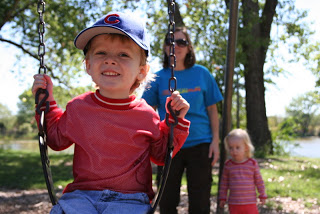
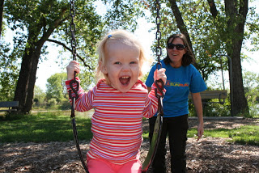

Welcome to A Mother's Pace.   
  
For a long time I've wanted to change the name of my blog. Healthy Mom on the Run was a good name but I didn't feel like it really expressed what I wanted to share on my blog. It was kind of all over the place with posts about my real food journey, running, kids and family. I knew that my main loves were running and my family. So that's what I wanted my focus to be. I continued to think about a new name and waited until I found the right one.   
  
My running habits have changed so much during my third pregnancy and it has made me realize how important running is to me. I really feel like 'me' when I am able to run with a fairly normal schedule. My mileage has gone down considerably at the beginning of this pregnancy but I am taking my time to really enjoy running when I am able to get out and hit the pavement. I appreciate it a lot more now that I'm not able to get out there 5 days a week.  
  
Being a mother and running now practically go hand in hand. I'm able to run if things are going well with the children at home and I feel as though I'm a better parent when I take some time for myself to head out for a run. I am able to go about my day and enjoy my time with my two (soon to be 3!) children.  
  

  

