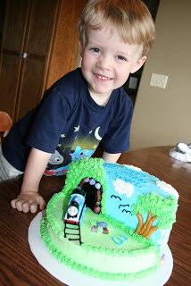

At 18 weeks pregnant I still have a running schedule, at least I try to keep a schedule. My goal right now is to run 3 times a week and I am failing. During the entire month of September I only met this goal once. Most weeks I ran twice but sometimes I didn't run at all. The biggest roadblock is the fact that usually I have to run early in the morning. Normally this is when I like to run because it's a great way to start off the day and I know that I get it in. The pregnant version of me is exhausted and not sleeping well at night. So when the early morning alarm goes off I've been hitting snooze. 

  

Luckily for me, we've had company in town the past couple of weeks (off and on) and so I've been able to get a run in a little later in the day while someone else watches the kids. 

<table align="center" cellpadding="0" cellspacing="0"><tbody><tr><td></td></tr><tr><td>Happy 3rd Birthday, O!</td></tr></tbody></table>

Yesterday, I had every intention of waking up to run. But after a busy birthday weekend for my son and a not so restful night of sleep I decided to once again hit the snooze. Sometimes sleep is just as important as running!

  

Fast forward to about 5:30 when my husband and I set out to go on our evening walk with the kids. We were trying to beat the rain but didn't make it. It started to sprinkle as soon as we were out in the driveway. We played outside in the rain for awhile instead of going on our walk and then headed inside after the kids started to get a little cold.

  

I really like our evening walks together and that's the main reason why I don't run after my husband gets off work. Walking with the kids in the rain is not so much fun but running in the nice cool rain is wonderful. I decided to head out for a little run before dinner. 

  

I had just enough time to run one loop of my neighborhood. Just over two windy and rainy miles later I was done and feeling great. I love how a run (even a short one) can really rejuvenate me.

<table align="center" cellpadding="0" cellspacing="0"><tbody><tr><td></td></tr><tr><td>18 Weeks, 5 days Pregnant</td></tr></tbody></table>
