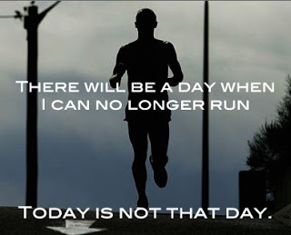
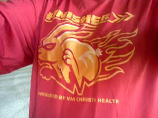

It's amazing how easy it is to forget what to wear in a certain temperature. This morning I woke up to a chilly 50 degrees. I woke up a little late but I decided to squeeze my run in before my husband went to work.   
  
I ran this morning! I only hit the snooze once! I got out of bed! Can you tell I'm excited???  
  
I headed out in my capris and long sleeve Finishers shirt from the Prairie Fire Marathon last October. I thought I would be warm enough but brrr... it was cold out there.   
  
It took me about a mile to stop shivering. The rest of the run was still cold but a little more comfortable. I guess in the end I had the right type of clothing on because if I had brought my jacket I would have been too hot by the end. I just would have really liked it at the beginning.   
  
  

<table align="center" cellpadding="0" cellspacing="0"><tbody><tr><td></td></tr><tr><td><a href="http://pinterest.com/pin/9851692906079901/" target="_blank">Source</a></td></tr></tbody></table>

19 weeks pregnant today and 30 minutes of running. I definitely didn't look like the man above during my 30 minutes this morning but I was happy to be out and enjoying my run. I would love to run the entire pregnancy but I know that might not be a realistic goal. I'm taking it one day at a time.   
  
On a side note, I think this winter I'm going to be glad that they ran out of my size of shirts (women's medium) at the marathon. My men's large long sleeve will come in handy as my belly expands and it gets colder outside.   
  
  

