October is one of my favorite months. I love the seasonal change to cooler weather. I love looking forward to the holidays. A visit to the pumpkin patch is a sure sign that Fall has arrived.   
  
Actually Saturday it was a little colder than our typical Fall day. A high of 55 and it was about 47 while we were at the patch. With the wind it felt a lot colder than that. Brrr!   
  
  

[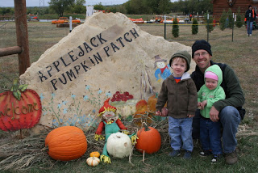](http://3.bp.blogspot.com/-Kf3F2FoV-vU/UHCtea_rWNI/AAAAAAAAAtE/p_JMUBCeXEI/s1600/IMG_7019.JPG)

  
There were no complaints from anyone in my crew though. We had a blast and enjoyed all the activities that the patch had to offer.  
  
  

  
Tire tunnels.  
  
  

  
Digging in corn.  
  
  

[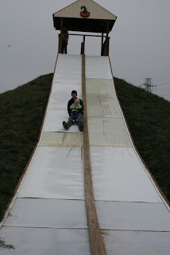](http://3.bp.blogspot.com/-ckixcDsc2XM/UHCtiZUOhkI/AAAAAAAAAts/6H9-IvBC_lw/s1600/IMG_7057.JPG)

  
A huge slide.  
  
  

[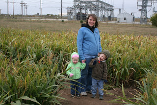](http://2.bp.blogspot.com/-XnMkbVWvAyQ/UHCtjVZ6BRI/AAAAAAAAAt0/JdpjQ1oddUo/s1600/IMG_7064.JPG)

  
A Milo maze.  
  
  

[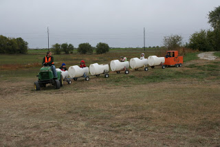](http://2.bp.blogspot.com/-RWuAFv_a2JM/UHCthhzlVdI/AAAAAAAAAtk/cUHzwoV2EZY/s1600/IMG_7048.JPG)

  

[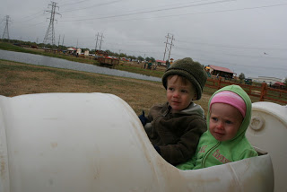](http://3.bp.blogspot.com/-VWteiAknK90/UHCtg6mEBaI/AAAAAAAAAtc/WPOmyDu-aVs/s1600/IMG_7046.JPG)

  
A tractor train. This was our favorite part. There is just something about putting your almost 2-year-old and just turned 3-year-old on a train and then watching them drive away. C.J. and I just laughed and hoped that they wouldn't panic while they were out for the ride. It only lasted a couple of minutes and once they were back (and off the train) they were all smiles and LOVED the ride. So fun.   
  
  

[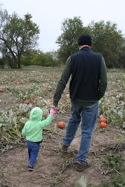](http://3.bp.blogspot.com/-K832P_FIYjE/UHCtkJzs-gI/AAAAAAAAAt8/-g8qadwYdrQ/s1600/IMG_7071.JPG)

  

[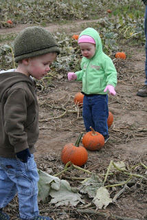](http://1.bp.blogspot.com/-kgjD-mxD0DY/UHCtlN8pS4I/AAAAAAAAAuE/5pYAyaD66ps/s1600/IMG_7073.JPG)

  

[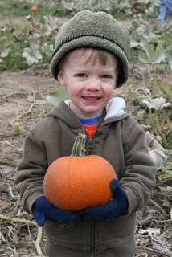](http://3.bp.blogspot.com/--8yjjQSQSDE/UHCtl0GzJxI/AAAAAAAAAuM/xyLpj2dkoxc/s1600/IMG_7074.JPG)

  

[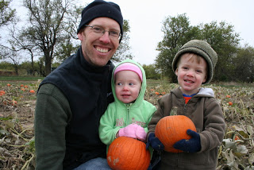](http://2.bp.blogspot.com/-ZkCEbb-ZxAw/UHCtnPT_KpI/AAAAAAAAAuU/x4mXvsbV6ds/s1600/IMG_7077.JPG)

  
And the pumpkins. After the tractor ride to the patch the kids walked around to pick out their perfect pumpkins. I think they did a pretty good job!  
  
  

[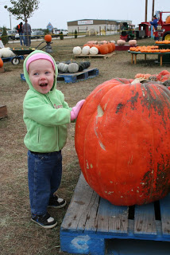](http://1.bp.blogspot.com/-qTAxdlIUpMA/UHCtnx3IyfI/AAAAAAAAAuc/5ZeuXH-Qmi8/s1600/IMG_7080.JPG)

  

[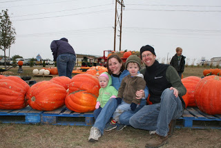](http://4.bp.blogspot.com/--DWZY8FH-JY/UHCtosxmdbI/AAAAAAAAAuk/8BUmMCypGiI/s1600/IMG_7088.JPG)

  
We had to stop by the huge pumpkins on our way to the car. As we were leaving it started to sprinkle.  
  
  

[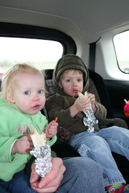](http://2.bp.blogspot.com/-91x7oYjtVNM/UHCtq9KWTRI/AAAAAAAAAu0/AhMUZBS2hUQ/s1600/IMG_7093.JPG)

  
We decided to eat in the car where it was warm and dry.  
  
  

[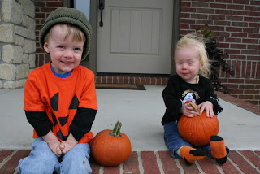](http://1.bp.blogspot.com/-uT_QYE3uZBM/UHCtrs-U-RI/AAAAAAAAAu8/op-y2iYFRZs/s1600/IMG_7095.JPG)

  

[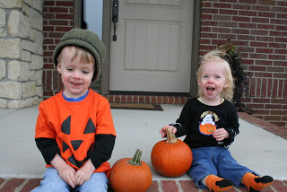](http://4.bp.blogspot.com/-pNpBWMqwG5M/UHCtsoe-nvI/AAAAAAAAAvE/smL0UMI6q_0/s1600/IMG_7100.JPG)

  
We ended up taking pictures with our fun pumpkin shirts after we got home. We took off the jackets, hurried to take the pictures and then went inside for nap time. The kids were worn out by our fun adventure and this mama was ready to get some rest in as well!  
  
  

[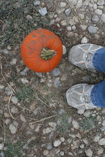](http://4.bp.blogspot.com/-REdGw2oYVmA/UHCtqD3uABI/AAAAAAAAAus/bj-CEg1qArc/s1600/IMG_7090.JPG)

  
Oh, and what better place to wear a really old pair of running shoes? You never know how muddy it will be at the pumpkin patch. I've actually thrown away shoes after visiting the patch because they were so caked. This pair survived though, they'll be back next year.
