Sunday was a day to run and a day to cheer on fellow runners. 

  

[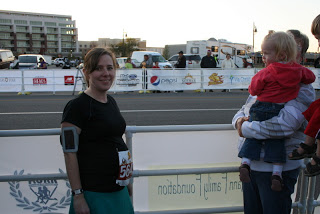](http://4.bp.blogspot.com/-6JK4Mat9zOM/UHxB1wECqnI/AAAAAAAAAxM/HTv1plxOD3w/s1600/IMG_7105.JPG)

  

I signed up for the Mayor's 5K Challenge as part of the Prairie Fire race series. I'm still running at 20 weeks pregnant even though I am running about 10 minutes slower (at the 5K distance) then I was before my pregnancy. It makes racing completely different but I'm glad I chose to run this 5K pregnant.

  

We cheered on the start of the full and half marathoners and then it was my turn to head to the start line. 

  

I decided ahead of time to just listen to my body and run at a comfortable speed. I'm running for enjoyment right now and not to break any personal records. 

  

There were almost 1,000 people in this race and it seemed pretty crowded at the beginning. It helped me to start out a little slower because there were a few times that I wanted to pass people and I couldn't get through anywhere. This is the main reason why I'm glad that I ended up running this race during a pregnancy. It would have been very frustrating if I were pushing for a PR or even just a certain time but kept getting trapped behind people. I had the same thing happen at the Glow Run last summer. It's just something that happens in the larger races. Hopefully next year I'll run the half marathon to complete my races from this series (including the full last year.) 

  

It was a beautiful morning. Clear skies and a little breezy. Mainly it felt good to push through the wind and it wasn't too much at all. 

  

After people spaced out a little I was really able to enjoy the scenery. The course took us through a little of the downtown area and then over the Keeper of the Plains bridge.

  

<table align="center" cellpadding="0" cellspacing="0"><tbody><tr><td><a href="http://amotherspace.net/wp-content/uploads/2012/10/IMG_41571.jpg" imageanchor="1">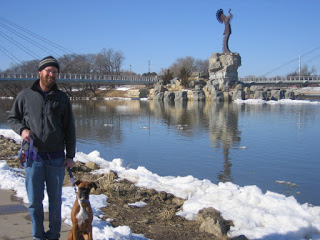</a></td></tr><tr><td>Keeper of the Plains bridge from 2008. Obviously, not from this race...we didn't have snow!</td></tr></tbody></table>

We followed the river back to the finish line. 

  

<table align="center" cellpadding="0" cellspacing="0"><tbody><tr><td><a href="http://1.bp.blogspot.com/-vpx9zaJv89w/UHxB-fMGcjI/AAAAAAAAAyk/WMvvcpRqhQA/s1600/photo+3.JPG" imageanchor="1">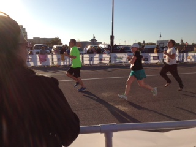</a></td></tr><tr><td>Photo taken by my mom</td></tr></tbody></table>

Official Distance: 5K (3.1 miles)

Nike+ Distance: 3.26 miles

Official Time: 34:48

Nike+ Time: 34:49

Official Pace: 11:14

Nike+ Pace: 10:40

Placement: 483 out of 979

  

I had a pretty good support crew with me and we decided to stay on to watch the half and the full marathoners finish running. We set up camp pretty close to the finish line and cheered on as the runners came in.

  

[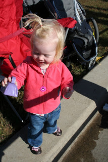](http://4.bp.blogspot.com/-QZ4LtxxB030/UHxB6AzYqkI/AAAAAAAAAx4/BH-EBEnUDF8/s1600/IMG_7120.JPG)

  

I knew a lot of people running but we were mainly there to cheer on my sister-in-law and other Team in Training runners. 

  

[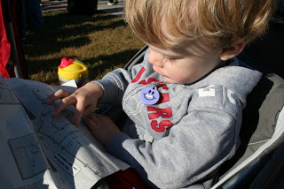](http://3.bp.blogspot.com/-4AK6dl6oW7Y/UHxB3Pdd5fI/AAAAAAAAAxc/m3OlnED1yAE/s1600/IMG_7110.JPG)

  

O spent some time with the map. He was trying to figure out where his aunt was running. 

  

[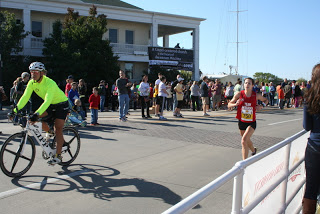](http://2.bp.blogspot.com/-jXvsXxKHHcI/UHxB5eUB-xI/AAAAAAAAAx0/IycOMpYKcmc/s1600/IMG_7119.JPG)

  

Here is a shot of the first female finisher. This was her first marathon and she finished in 2 hours, 59 minutes and 22 seconds! 

  

[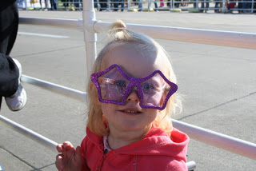](http://3.bp.blogspot.com/-6u-2lZRfscQ/UHxB3-VaN1I/AAAAAAAAAxk/XUroiFQ0VQk/s1600/IMG_7115.JPG)

  

[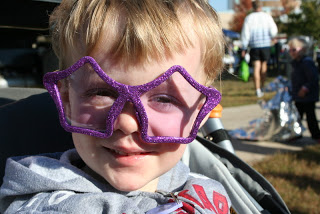](http://3.bp.blogspot.com/-7hqySN2TKcU/UHxB4hX4YBI/AAAAAAAAAxs/sBxAEPf5Mpc/s1600/IMG_7117.JPG)

  

When you are hanging out with the Team in Training crew there is always something fun and purple around. 

  

[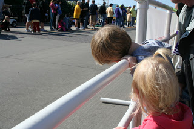](http://2.bp.blogspot.com/-rzr2f4w3rXM/UHxB61cIOwI/AAAAAAAAAyE/-wojCPFjL9s/s1600/IMG_7123.JPG)

  

Here comes Aunt Chi-Chi!

  

[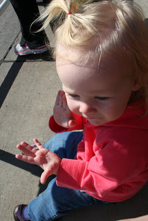](http://3.bp.blogspot.com/-0WBS2hOPVyM/UHxB7vGcjeI/AAAAAAAAAyM/lXo4kp2x-2g/s1600/IMG_7128.JPG)

  

A little more cheering and clapping.

  

[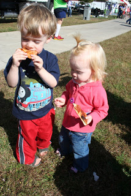](http://3.bp.blogspot.com/-TZI4w8vlLtw/UHxB8uwXBTI/AAAAAAAAAyU/7UjI1RqTy1Y/s1600/IMG_7129.JPG)

  

[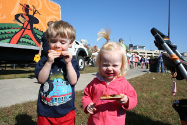](http://3.bp.blogspot.com/-Fo3zbosjfyQ/UHxB9e0QsWI/AAAAAAAAAyc/lwo7CEQLwQI/s1600/IMG_7131.JPG)

  

And finally lunch! It was a long morning from about 7:30 to a little after 1:00 but the kids (and the grown-ups) had fun. There was live music to dance to, good food and tons of people watching going on. What a fun race environment!

  

<table align="center" cellpadding="0" cellspacing="0"><tbody><tr><td><a href="http://2.bp.blogspot.com/-PUz_3pS3G3U/UHxB2l9rV4I/AAAAAAAAAxQ/Eu1myVCVia8/s1600/IMG_7109.JPG" imageanchor="1">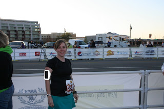</a></td></tr><tr><td>Wichita Prairie Fire Mayor's 5K Challenge: 20 Weeks Pregnant</td></tr></tbody></table>
