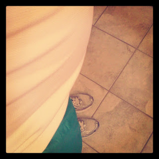
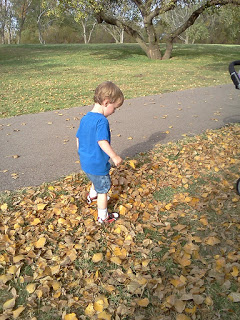
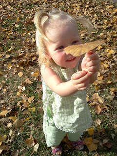
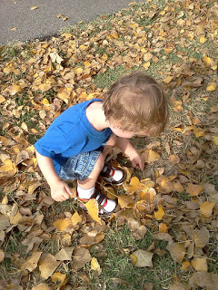
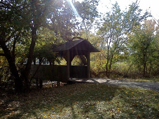

There hasn't been a whole lot of running happening around here this past week. I attempted a run early Monday morning and didn't make it very far. I completely forgot to put on my belly band before heading out. Wow! I had no idea how much that really helps me to feel comfortable while running. I finished a little over a mile and then decided to head home instead of risking pulling a belly muscle.  

  

  
22 weeks along and I feel big and uncomfortable already. I was hoping that running during this pregnancy would help me not feel so huge so soon...I guess not!

  

  

I did get my fair share of exercise in this week though. The kids and I went on a Fall walk to gather leaves for school. Of course I picked the windiest day and the park with the most hills. 

  

  

Even so, we enjoyed our outing and found a lot of crunchy leaves. I was hoping for more red leaves but we mainly found yellow and brown. 

  

  

We watched squirrels chasing each other and walked beneath leaves falling from the trees. It was beautiful. Just another reason why this is my favorite season.

  

