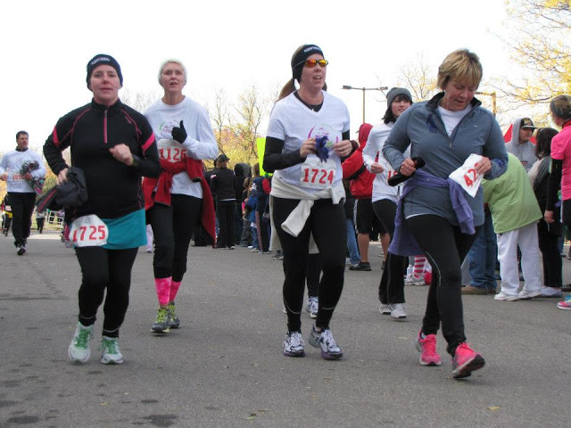
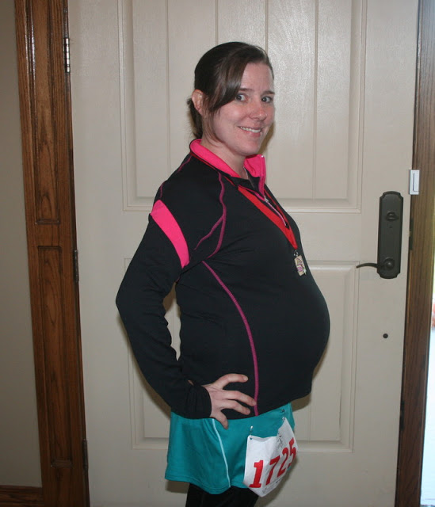

Lately my running has been sporadic and short. Since my last 5K race the greatest distance I have accomplished at one time: 2.2 miles. I knew that running 3.1 miles was going to be challenging and I wasn't exactly sure how I was going to accomplish it (running the whole thing or walking part/all of it) but I knew that I wanted to go and have fun. That's what I did!  
Before the race my sister-in-law and I talked about running together. We would start together and see how far along we got. The problem was that she is recovering from an injury and might need to walk part of it and my sciatic nerve actually likes me better if I run instead of walking quickly. Ahhh, pregnancy, so many things that are just crazy and don't really make any sense!   
  
Another of our Team in Training friends (who was having some knee pain and was up for walking or running) joined us. We ended up running the whole race and finished together. Running together made the race go by very quickly and I'm sure they both made me faster. I would have broken down and walked some of it if I didn't have their support. Thank you, ladies!  
  
  

<table align="center" cellpadding="0" cellspacing="0"><tbody><tr><td><a href="http://amotherspace.net/wp-content/uploads/2012/11/GoTR5K201223.jpg" imageanchor="1"></a></td></tr><tr><td>That's me in the teal skirt. 24.5 weeks Prego <a href="https://www.facebook.com/pages/The-Running-Connection-Wichita/203709829690426?fref=ts" target="_blank">Source</a></td></tr></tbody></table>

The weather was not ideal before or after the race but during it was wonderful. I think it was around 35 degrees with just a touch of breeze. It was cloudy but the sun tried to peak out a few times and warm us up.  
  
This course is one of my favorites in Wichita. (Minus some uneven roads that could be dangerous.) When I was in high school and running in cross country we ran many miles down these same streets. I'm not in this part of town very often so it always takes me down memory lane when I do this race.  
  
All in all, it was a fun race and I'm very glad that I missed my afternoon nap to get out and run with the girls. It's so inspiring to see all the young girls running their first race. What a great organization! Once my life slows down a little and my own children are a little bit older I would like to help out with either coaching or mentoring with the Girls on the Run organization.  
  
  

  
Official Distance: 5K  
Nike+ Distance: 3.13 miles  
Official Time: 40:58  
Nike+ Time: 39:33 (It started a little late, had problems syncing)   
Overall Placement:390/678  
Somehow my age stats didn't get registered and so I don't have any age grade information. I'm glad this happened on a race that I wasn't really 'racing' or I would have been very disappointed.   
  
  

  
I'm at that point now where I see a picture of myself and I'm amazed at how big my belly has gotten. 24 weeks pregnant here and 3 and a half more months to go!  
  

\-------------------------------

  

Find A Mother's Pace on...  
  
Twitter [@amotherspace3](https://twitter.com/amotherspace3)  
  
Facebook [amotherspace3](http://facebook.com/amotherspace3)  
  
Instagram [amotherspace](http://instagram.com/amotherspace)  
  
Pinterest [amotherspace](http://pinterest.com/amotherspace/)  
  
Bloglovin' [A Mother's Pace](http://www.bloglovin.com/en/blog/6680087)  
  
RSS [amotherspace](http://feeds.feedburner.com/amotherspace)
