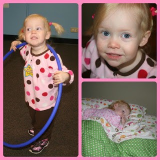

It's been a pretty busy week around here.   
  
Traveling for Thanksgiving.   
  
A big birthday to celebrate.   
  

  
2 years old! We celebrated at her Move & Groove class and at the zoo. It was a cold day to be outside but we enjoyed it. She also got a big girl bed this week. Big changes at our house and she's doing great with them.  
  
And now we are getting ready for her party this weekend.   
  

\-------------------------------------------------------------------

  
Thanks to my [new treadmill](http://amotherspace.blogspot.com/2012_11_01_archive.html#3667490366481981248), running is going well. It's just a little bit at a time and only every few days. But I'm running! 27 weeks pregnant today.  
  
I'm loving wearing shorts again while running. Putting out the summer running clothes the night before helps me to get ready a lot quicker in the morning. It's much easier to put on shorts and a t-shirt than all the layers that are required for running outside during this cold weather. Dressing with my big belly is quite an effort...as is just about everything these days!  
  

  

This morning I tried doing a run/walk to see if I could get in more than my usual 1 mile that I have been running for the past week or so. I started out at a 4:1 ratio for the first 1.5 miles and then switched to a 3:2 ratio for the last half mile. I liked doing this better then running the mile at the beginning and walking to round out my 30 minute(ish) workout that I have been trying to get in. I was also on the treadmill for about a half a mile longer (with my walking cool down at the end) and for about 10 more minutes. Success!
