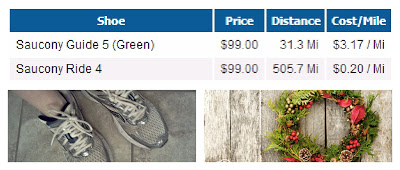
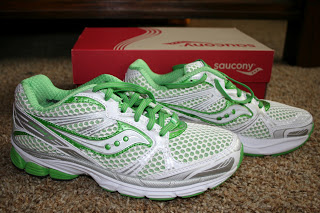
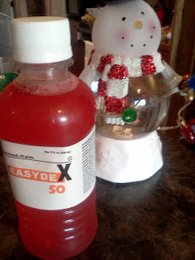

When I started training for my first marathon I found my first pair of Saucony Rides and I loved them. About a month before the marathon I bought my second pair but didn't end up running the marathon in them because they weren't quite broken in yet.   
  
These shoes never saw a marathon but they did see plenty of miles.  
  

  
I'm over the 500 mile mark now and I'm not quite ready to give them up yet.   
  
I love that Runner's World breaks down the price per mile for me. $.20/mile! Not bad.  
  
At this point in my pregnancy (27 weeks, 6 days) I am just running 1 or 2 miles at a time so I'm keeping the shoes for now. They still feel good on my legs and feet. My new shoes, the Guides, are being broken in slowly. I try them on occasionally and run. I've yet to notice a big difference between the two so I'm taking that as a sign that I can keep running in my Rides.  
  

  
I ended up with the Guide 5's completely on accident. I went into the local running store and asked to try on the new Saucony Rides. I tried them on, thought they fit differently just because of the upgrade, still loved the fit though and purchased them. It was about a month or so ago that I noticed that they were _Guides_ and not _Rides_. It took me a long time (too long!!) to notice this! I believe the Guides are more for people with a tendency to [overpronate or underpronate](http://www.runnersworld.com/running-shoe-basics/pronation-explained) and I have never had that problem. They are still comfortable but I haven't done a long run in them yet. It will be interesting to see if I notice a difference when my longer runs start up after my pregnancy.   
  

\-------------------------------------------------------

  

A pregnancy update.

  

I had my fun glucola test this week to check for gestational diabetes.

  

  

No results back yet but it's always fun to drink this disgusting stuff before the appointment.

  

My weight is a little high. On one hand it surprises me because I'm exercising a lot more during this pregnancy. On the other hand it doesn't surprise me at all because I feel huge already! I'm starting to pay more attention to the quality of food that I am eating and trying to cut out more sweets. It's hard for me because I have a ginormous sweet tooth during my pregnancies. My self control is definitely challenged right in the middle of the holidays. It seems like goodies are everywhere! I'm also starting to map out my exercise for the week each week again. I'm going to try alternating walking days and running days and only take 1 or 2 rest days a week.

  

The baby has shifted a little and is not sitting on my sciatic nerve. It has made the past couple of days feel so much more comfortable for me. It's much easier to go down to the treadmill in the morning for a walk or run when my nerve isn't pinched! I thought this was good news but evidently the baby might be in the breech position. There is still time for the baby to flip over so we are watching for this to happen in the next few weeks.

  

28 weeks tomorrow!
