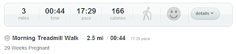

I started logging my miles on [Runner's World](http://runnersworld.com/) awhile ago. It helps motivate me to keep track of the numbers behind running. I loved the 'Classic' version that allowed me to enter in previous data and update my new workouts daily.  
  
There are so many great features on the RW log beyond just logging running miles.   
  

- tracking other specific workouts besides running. I particularly like logging strength training details.
- keeping track of shoe mileage _easily_
- accurate mileage information
- Run Summary page that summarizes weekly, monthly, yearly and total mileage
- PR information and daily workouts sent straight to my blog page
- a calendar to look at a monthly overview of past workouts
- really, I could go on and on

I'm sitting here trying to think of something that I didn't like about it and only two things come to mind and they are not big things at all!  
  

- scheduling future workouts on a calendar
- there is no app for a smartphone 

  
Then they had to change everything. Why does that always happen? You find something that you _love_, get used to using it and then it's gone. A favorite shampoo, face wash, mascara, eye shadow and now my running log??? Aghhh!  
  
Yes, Runner's World announced that they were moving toward eliminating the classic version. The \*good\* news was that they were launching the TrainingPeaks Personal Trainer, which includes a free running log on their basic level.   
  
Initially I was excited. All my data would easily transfer and they were promoting it as much better than the classic version! Yea!  
  
Except one problem. I don't like the new Personal Trainer. It's very complicated. I've looked at it a few times and I just can't figure it out. I want and need something that is easy to use and doesn't take much of my time.   
  
So I've been shopping around. The bright side is that I'm currently not running and so I can play around with different logs with walking stats and hopefully find one that works for me.   
  
Before I stumbled upon the Runner's World log I had been using [DailyMile](http://dailymile.com/) a little bit. I decided to give it another try.  
  
DailyMile Pros:  
  

- It's fun and social
- easy to log miles or workouts every day
- Nike+ syncs to it automatically!
- an o.k. update of current workout sent to my blog
- It tracks other workouts besides running and you can make specific graphs to see what you have done. (Not as specific as RW though.)

  

<table align="center" cellpadding="0" cellspacing="0"><tbody><tr><td></td></tr><tr><td>Actual mileage: 2.5 miles Mileage listed on log: 3&nbsp;</td></tr></tbody></table>

  

<table align="center" cellpadding="0" cellspacing="0"><tbody><tr><td></td></tr><tr><td>This doesn't even make sense to me...how is this possible???</td></tr></tbody></table>

  
DailyMile Cons:  
  

- The two screen shots above summarize my biggest problem. It is not accurate. They round the mileage to the closest number and I'm not even sure where they came up with the numbers for the second screen shot. I don't really know how to get around this con.
- Entering in shoe mileage isn't automatic. I'm going to forget to enter it and I really like to keep track of the miles on specific shoes.
- probably more but I am stopping here with the big ones.

  
So I need to keep looking. I'm considering paper for my real training log and using the dailymile or another web log for screen shots. It's not ideal but I would have no one to blame but myself for accuracy!  
  
What kind of training log do you use? Paper and pen or something online? Please share and let me know what you think about it!
