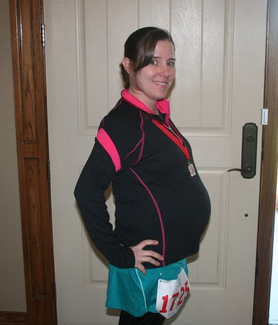
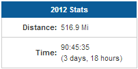
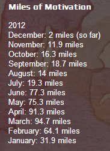
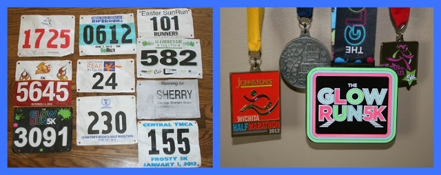
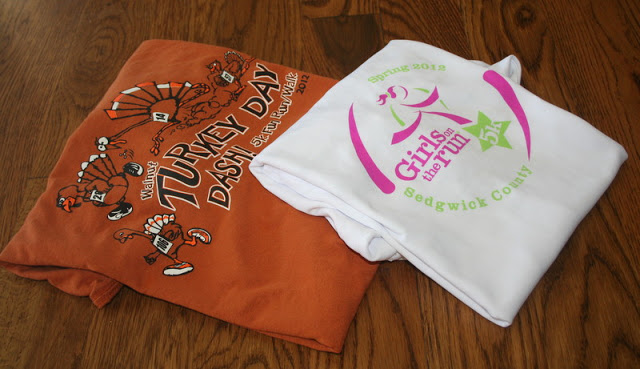

Running in 2012 wasn't exactly what I thought it would be but overall I'm happy with how my year turned out. Pregnancy affected my running a lot more than I thought it would but I was able to keep it up through 27 weeks of pregnancy.   
  

  
My goal race for the year was the Johnston's Half Marathon in April. Training went well and I ended up with a PR. My postpartum goal race for next year will also be a half marathon but we'll talk about that later.  
  
Here is my year in numbers.  
  
516.9: Number of overall running miles  
  

  
12: Number of running months  
  

- Yay! I made all 12, just barely. 

  
  

  
10: Number of races completed  
  

- 5 5K's, 1 4 miler, 2 10K's and a Half Marathon, also a memorial run for Sherry Arnold

  
  

  
4: Number of medals earned  
  
5: Number of PR's (Personal Records)  
  

- 1 Half Marathon, 2 10K's, 1 4 Miler and 1 5K

  
  
2: Number of DNS (did not start) races  
  

- I was sick before the spring Girls on the Run Race and too pregnant for the Turkey Day Dash so I chose not to run those races.

  

  
171.3: Number of pregnant running miles  
  

  
18.72: Number of pregnant walking treadmill miles  
  
I have a lot of ideas for what I would like to accomplish in 2013...it's going to be a good year!   
  
Happy New Year!  
  
  

\-------------------------------

  

Find A Mother's Pace on...  
  
Twitter [@amotherspace3](https://twitter.com/amotherspace3)  
  
Facebook [amotherspace3](http://facebook.com/amotherspace3)  
  
Instagram [amotherspace](http://instagram.com/amotherspace)  
  
Pinterest [amotherspace](http://pinterest.com/amotherspace/)  
  
Bloglovin' [A Mother's Pace](http://www.bloglovin.com/en/blog/6680087)  
  
RSS [amotherspace](http://feeds.feedburner.com/amotherspace)
