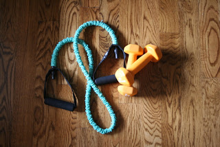
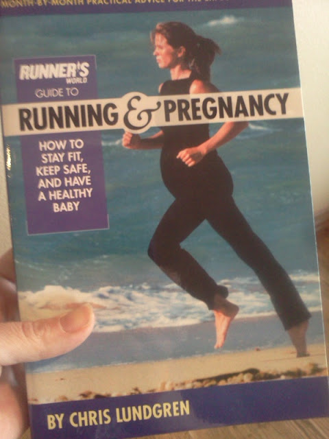
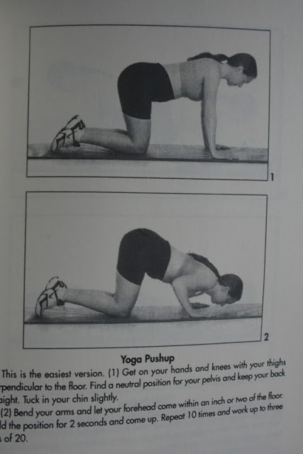
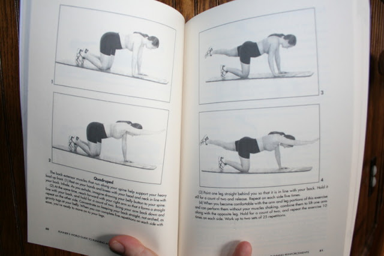

While training for my half marathon last spring I decided to add strength training to my routine. I never really loved weights but I had done them off and on either at home or at the Y. I had been doing more reading about running before my half (which was my 3rd) and I wanted to do my best and cut some time off for a PR.   
  
I stuck it out and did weights at home at least two times a week.  
It became a habit and I kept it up after the half but then I found out I was pregnant.   
  

  
The first trimester was extremely exhausting for me and I gave up doing my weight routine during the kids nap time. Instead I rested...which is what I needed at the time.  
For the past several weeks I have been adding in a little strength training. At the beginning of January I decided to officially try to get two sessions in a week. It is tough! My arms are not so bad but it's my legs that are out of shape.   
  

  
I turned to my "[Pregnancy and Running](http://amzn.to/19KPOUn)" book for some tips and found a pretty good workout. It seems insanely easy when I look at it but then I try and actually do it and it is a different story!  
  
The move that made me laugh when I first looked at it is now one of my favorites to do. The Yoga Push Up.  
  

  
It looks so easy, right? Well it is, but I can also feel it in my arms and my belly is too big to do any other kind of push up.   
  
The hardest move for me is the Quadruped.   
  

  
I did this move before my pregnancy and it wasn't difficult. Now it is extremely hard on my legs and I can only do a couple of them at a time. My inner thighs don't like this one at all. It gets easier every time though.  
The book also highlights squats and leg curls. It's a quick workout so I've also kept up with some moves that I did before pregnancy incorporating my resistance band and my 5 lb. weights. Leg lifts, squats, various arm movements. I'm finding out that it feels good to work these muscles again and I'm only adding in a little at a time.   
  
I hate to say that I wish that I had been able to keep up with the weights the whole pregnancy. I've done what I could during this pregnancy. It is difficult to start them again at this stage (33 weeks pregnant) but better late than never, right? I know every pregnancy is different and I'm happy with how active I've been during this one, especially when I compare it to how _inactive_ I was during my previous two pregnancies.  
  
So, that's what I'm doing to incorporate strength training during my pregnancy. **What has worked with you? Did you keep up with strength training or let it slide?**  
  
  
\*The above opinions are my own. Please consult your doctor before deciding on your own exercise plan during pregnancy.\*  
  
  

  

\-------------------------------

  

Find A Mother's Pace on...  
  
Twitter [@amotherspace3](https://twitter.com/amotherspace3)  
  
Facebook [amotherspace3](http://facebook.com/amotherspace3)  
  
Instagram [amotherspace](http://instagram.com/amotherspace)  
  
Pinterest [amotherspace](http://pinterest.com/amotherspace/)  
  
Bloglovin' [A Mother's Pace](http://www.bloglovin.com/en/blog/6680087)  
  
RSS [amotherspace](http://feeds.feedburner.com/amotherspace)
