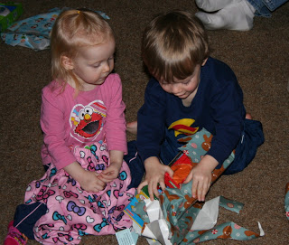
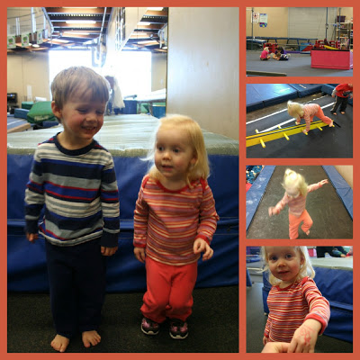

Yes, it is the middle of January and our Christmas tree is still up. We've been in the process of taking down decorations and now everything is down except for the actual tree. I was procrastinating waiting for our final family Christmas and that happened this weekend. I'm not sure that the kids will know what to do now that we don't have any more presents to open until their birthdays in the Fall!  

Since we had family around we had a lot of meals together. This included a couple of vegan dishes. My husband deserves a medal because he worked so hard to make our meals happen for this weekend. :) All I did was pick out a recipe for the Mexican dish (Naughty and Nice Vegan Enchilada Casserole) that I found on a blog.

Source: [ohsheglows.com](http://ohsheglows.com/2011/12/13/naughty-nice-vegan-enchilada-casserole/) on [Pinterest](http://pinterest.com/)

  
  
I am not a food blogger so I don't have any pictures of my own but the above is what I pinned to my pinterest recipe board. It was delicious! And my brother, the vegan, loved it too. Check out [ohsheglows.com](http://ohsheglows.com/) for a ton of fabulous vegan recipes!  
  
We also made a vegan green curry for another meal. Um, I say we but I had nothing to do with it. I didn't even pick out the recipe. My wonderful husband made it and it was a big hit. Reminds me of the weeks and months after we had just started dating. We used to make curry a lot and it was always so tasty. I'm not sure why we stopped making it...it is definitely making a comeback now.  
  
The kids are currently enjoying gymnastics that they take at the local Y. They are both in different classes but both have a blast. We look forward to it every weekend! Little O just wants to learn how to do a somersault. We are still working on that skill. :)  

Daddy goes in and helps with Little A's class so we have some good pics of her. O's class is just with the teacher and the pics don't come out so well through the glass.   
  
I love watching the kids when they are active!  
  
  

Finding Making time to walk was challenging last week. I managed 3 times but I really want to keep it at 5 days. I'm hoping for more miles this week. Strength training is going well. I'm doing some small moves throughout the week when I have a few minutes as well. It's amazing how different I feel just doing a few exercises a week. I'm so glad I'm incorporating it into my fitness schedule now!   
  
I had another doctor visit this week and all is well. Nothing to report at this point is always a good thing!   
  
34 Weeks Pregnant tomorrow and only 6 more to go!
