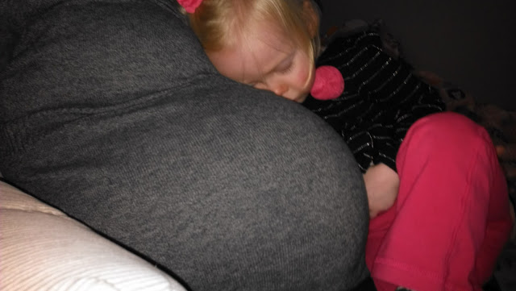
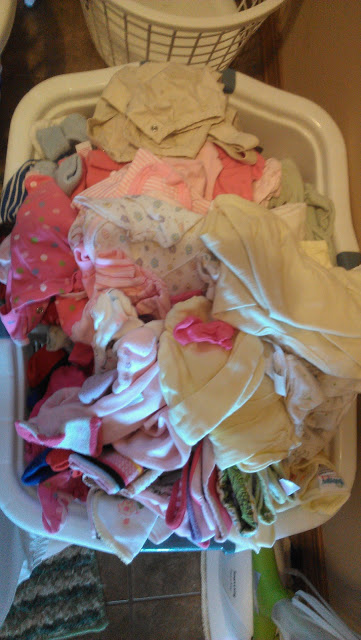
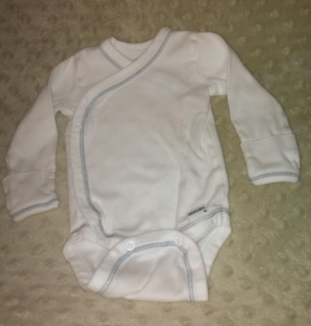

Thoughts during my 35th week of Pregnancy.  
  
  

<table cellpadding="0" cellspacing="0"><tbody><tr><td></td></tr><tr><td>I'm not sure if the baby bump is more or less comfortable during nap time snuggling. 
 
</td></tr></tbody></table>

This time around we decided to NOT find out if we were having a boy or a girl. We found out with our other two children but since we have one of each and don't really need to buy anything for this baby we decided to wait and be surprised.  
  
Back when we had the ultrasound done I was o.k. with our decision and the tech even told us that it was probably a good thing we didn't want to know because the baby wasn't 'cooperating' anyway.  
Now my due date is coming closer and closer and I'm getting more and more impatient.   
  
I've started washing the baby laundry.  
  
  

  
  

Newborn plus 0-3 month clothes for boy, girl and neutral. I had no idea how many clothes we already had!   
  
I'm a little saddened by some of the spit up stains that have shown up on the clothes after years of being in storage. They were all clean when I put them away but I had a lot of surprises on the boy clothes especially. Is there anyway to get these stains out now or is it too late???  
I've also been washing bedding and blankets too. I think I'm seriously nesting! My husband thinks so too. I came out of the laundry room holding this adorable side snap onesie proclaiming how much I love side snaps on little tiny babies. He just looked at me like I was crazy and said something about me being in the nesting mode.   
  
  

<table align="center" cellpadding="0" cellspacing="0"><tbody><tr><td><a href="http://amotherspace.net/wp-content/uploads/2013/01/IMAG0063-11.jpg" imageanchor="1"></a></td></tr><tr><td>Adorable, right?</td></tr></tbody></table>

I'm talking about laundry too much. Even if it is cute little baby laundry...my favorite kind!  
Hands down, the hardest thing about not knowing if this baby is a boy or a girl is deciding on the name. With our other two children we knew the names very early on, pretty much right after we found out the sex of the baby.   
  
Here we are almost a month out and we haven't officially decided on a name. We have to decide before the hospital. For a couple of reasons. First, I don't want the added stress of making that decision after the baby is here. Second, I have always made a scrapbook sheet with the baby's name on it for visitors to sign when they come to the hospital. I want to get this ready soon so I can start to get a bag together for the hospital.  
  
I'm also a little concerned about our oldest. He really wants a brother and I'm afraid of his initial reaction if we end up having a girl. I know he'll adjust and love his sibling but it will be interesting to see _how_ he reacts.  
  
  

  

Overall, I'm still glad we decided to wait. It will make the actual birth so exciting for us and all of our family and friends. We are so blessed to have our third baby on the way and really are just so excited to hold that little bundle of joy in either a pink or a blue blanket.  
  
  

\-------------------------------

  

  

  

Find A Mother's Pace on...

  
Twitter [@amotherspace3](https://twitter.com/amotherspace3)

  
Facebook [amotherspace3](http://facebook.com/amotherspace3)

  
Instagram [amotherspace](http://instagram.com/amotherspace)

  
Pinterest [amotherspace](http://pinterest.com/amotherspace/)

  
Bloglovin' [A Mother's Pace](http://www.bloglovin.com/en/blog/6680087)

  
RSS [amotherspace](http://feeds.feedburner.com/amotherspace)
