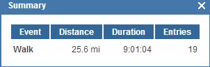
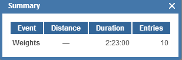

January marked the first month in a very long time that I logged ZERO running miles. Well, maybe not a _very long_ time, but definitely since my 2 year old was born.   
  
That doesn't mean that I didn't make time for exercise and I even added more strength workouts this month too.  
  
  

  
I walked over 25 miles, mostly on the treadmill. I can't say enough how happy I am that we decided to go ahead and buy a treadmill. I wouldn't have been motivated to go outside in the January cold to just walk. For some reason it doesn't bother me to run outside but walking seems different.  
  
I'm not a speedy pregnant walker and I've noticed in the last week that I've had to slow down even more but I'm keeping up with it as long as I can. I try to get in 1.5 miles 5 days a week. I was able to accomplish this for 3 weeks in January.   
  
  

  
I also completed 10 strength training workouts. I'm really happy with this one because I had given up on strength training during this pregnancy and then decided to add it back in. I feel so much better and I'm glad I've been sticking with it. My sessions don't last that long. I think the shortest was 8 minutes and the longest was 20 but all those minutes combined have made me stronger. It's renewed my \*love\* (that might be too strong of a word!) for strength training and I'll be ready to get back into regular training after the baby is born.  
  
I'm looking forward to February. My baby's due date is the 28th so we'll see how my walking and strength training change the closer I get to delivery!
