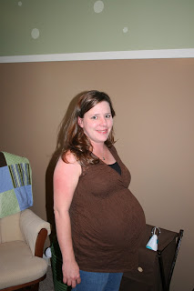
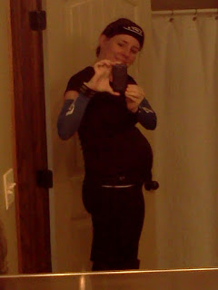

I had grand ideas of my weight gain being different for my third pregnancy. I guess it's turning out to be a little different but not in the way I had expected!  
  
In my first two I gained 40 pounds both times around.  

<table align="center" cellpadding="0" cellspacing="0"><tbody><tr><td></td></tr><tr><td>Pregnancy #1, within a week of my due date.</td></tr></tbody></table>

<table align="center" cellpadding="0" cellspacing="0"><tbody><tr><td></td></tr><tr><td>Pregnancy #2, within a week of my due date.</td></tr></tbody></table>

During my first pregnancy I exercised when we took our dog for an evening leisurely walk and I also went to a weekly water aerobics class. During my second pregnancy all I did was my evening family walk and chase after my mobile baby. I wasn't able to sneak away for the water aerobics and I didn't find something to replace it. 40 pounds, both times!  
  
  

<table align="center" cellpadding="0" cellspacing="0"><tbody><tr><td></td></tr><tr><td>Pregnancy #3, sometime in the 2nd trimester.</td></tr></tbody></table>

This time around I've been exercising much more. I ran regularly until my 27th week of pregnancy. After that I kept walking on the treadmill and I have been doing at least two strength training workouts a week. Guess what, I'm still looking to gain 40 pounds! Aghh!   
  
I guess this is how my body responds to pregnancy and \*maybe\* this time around it will be easier to shed the weight after the pregnancy is over. I'm currently 17 days from my due date and I have 2 pounds to gain to get to 40. 
  
  

<table align="center" cellpadding="0" cellspacing="0"><tbody><tr><td></td></tr><tr><td>Pregnancy #3, 37th week.</td></tr></tbody></table>

I was pretty disappointed about my weight gain for awhile but now I've just decided that there's obviously nothing I can do about it at this point and I'm healthy. Being healthy is the most important part.   
  
  

