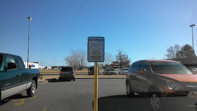
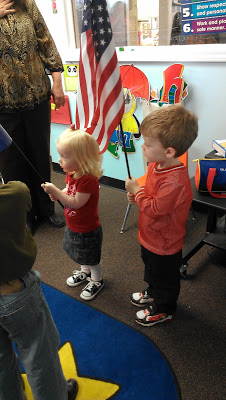
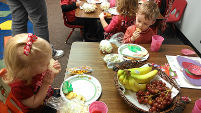
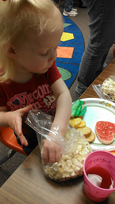
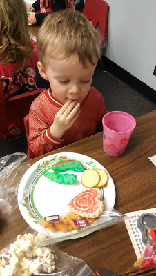
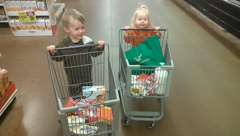

It's been a pretty low key week around here.   
  
We've done a couple of errands to get ready for the baby. Some unsuccessful. I really wanted to get 'Big Brother' and 'Big Sister' shirts for the kids before the baby comes but I can't find them anywhere. I tried BabiesRUs and took advantage of this parking spot.  
  

  
I've been pretty active throughout this pregnancy and so I haven't parked in the expectant mother spot very much but I now intend to park here whenever I can until I deliver!   
  
Back to the shirts. I've given up on trying to find them and I've also given up on finding a nice neutral outfit for the baby at the hospital. Everything is either in blue, pink, yellow or green. I really was hoping to find something in an oatmeal color. We just went ahead and bought a blue outfit and a pink outfit and we'll give away what we don't end up using.   
  
Speaking of giving up things, I've officially given up on treadmill walking for this pregnancy. The baby has shifted and is much lower. I get uncomfortable very easily during the day and walking really hasn't helped it. So I have decided to call it quits. Our treadmill isn't collecting dust though....my husband has started using it!  
  

  
Both of my kiddos were the flag helpers at school this week. We also found out that Little O can completely say The Pledge of Allegiance all by himself. He did it for us at lunch the afternoon after being the flag helper and we were shocked that he could recite the whole thing. So fun!  
  

  
We also had an early Valentine's Day party. We shared Valentine's and had way too much food! We ended up taking a bunch of it home.  
  

  

  
We spent Tuesday morning making Valentine's to send to family. The kids were covered in paint but they were fun to make.   
  
The small shopping carts at the store are the best! It made shopping so easy and fun. I can now envision each older child with a little shopping cart and the baby in a big one for each shopping trip we make without Daddy. I hope it continues to be exciting for the kids. They were so helpful and had fun putting their own items in their own cart.   
  

  
My doctor's appointment went well this week again. I'm progressing a little and the baby has dropped, as I mentioned above. I'm still having a lot of contractions and some of them are feeling pretty strong. I'm down to 14 days until my due date. Sometimes it feels like time is crawling and then I realize that (hopefully!) within two weeks we'll have a new person living in this house with us. Two weeks isn't very long at all. Can't way to meet this new little baby.  
  
38 weeks tomorrow!
