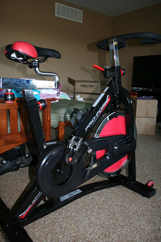
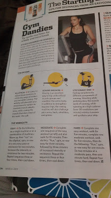

I've never been one to be too serious about cross training. Running is my favorite form of exercise and it's what I'm most motivated to do. Lately, I've been toying with the idea of adding at least one day a week of cross training to my workout schedule. That is, after baby, of course.  
  
In the past I've gone for recovery bike rides outside. I've dabbled with yoga a little. But really the only other form of exercise that I've consistently accomplished during a training or maintenance cycle is strength training.   
  
This time around I want things to be different. We now have a bike trainer in our basement that I have used once or maybe twice...months ago.  
  

  
It's really for my husband, but he lets me use it. I'd like to start adding some biking to my cross training days when I am at home.  
  
When I am able to head to the Y I can jump on the elliptical or the rowing machine...or both!   
  
Thanks to this article from Runner's World (current March issue), I was able to get some great tips on how to incorporate easy, moderate or hard cross training workouts.   
  

  
I'm hoping that the cross training helps me to return to my typical fitness level more quickly after my pregnancy. Hopefully it will be easier on my body than just running and will allow me to eventually build up my running base to a good maintenance level.   
  
Of course, I'm going to follow my doctor's advice concerning when to start walking, biking, running and any other cross training that I do postpartum.  
  
38.5 weeks of pregnancy down. Less than a week and a half to go...let's hope. :)
