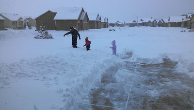
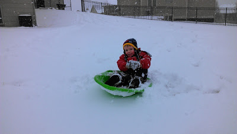
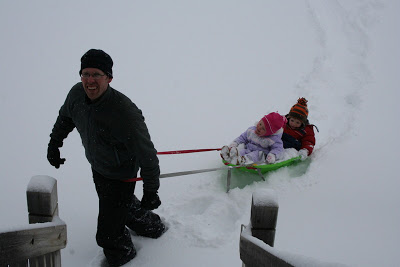
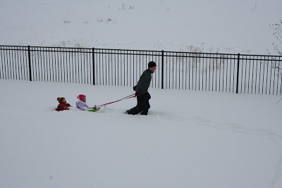
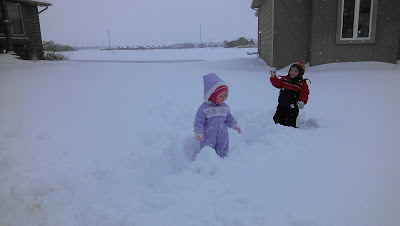
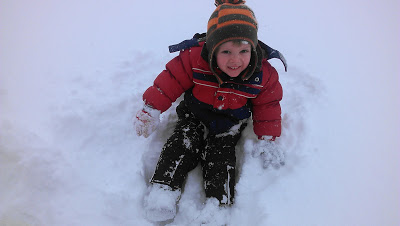

Running in snow is fun. Of course, there are certain conditions that need to be present to get me out there instead of on a treadmill. Mainly, no ice and light snow. Not very deep but I can handle a couple of inches.  
  
Some of my favorite, most memorable runs have been during or after a snowfall. It's beautiful out and everything looks so nice and clean. I don't mind the cold so much when there is snow on the ground. It must distract me.  
  
  

  
Typically we don't get a lot of snow where I live. A few days ago we got 14.2 inches, officially. Just under an inch more and we would have broken an all time record. Schools were shut down for two days and we stayed inside our warm home most of the time. Needless to say, even if I wasn't 39 weeks pregnant I would not have been outside braving the snow trying to get some miles in after this storm. I'm sure some people did though.  
  
  

  
We also had back up plans for the back up plan to get me to the hospital if I went into labor during the storm. 7 days away from my due date and the biggest storm of my lifetime comes to town. I kind of expected to go into labor...but I didn't. :)  
  
Instead my husband took off work early and he and the kids enjoyed some snow time outside. (My husband works from home so he didn't have a snow day like so many others in town.)  
  
  

  

  

  

  

  

He is such a good daddy! The kids had a blast and created some wonderful memories. Between towing the kids around and shoveling the driveway, Daddy got a pretty good workout in for the day!

  

Oh, and here's the kicker. Today another storm is coming through town and I've seen forecasts anywhere between 4 and 16 inches! High winds and blizzard conditions. I'm happy for the moisture because we need it so much but not happy that it's happening 3 days before my due date. Right now I'm just hoping that we make it to the hospital, if needed!
