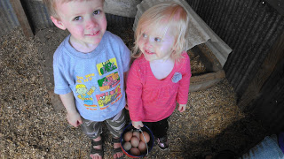
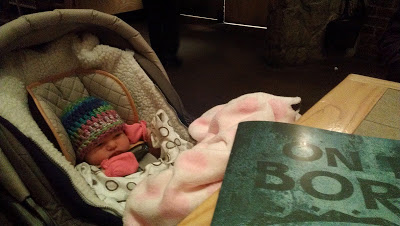
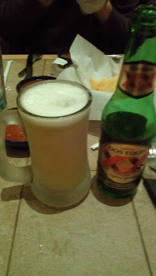

There have been a lot of 'firsts' around here lately. Here are five of them:  
  
1\. First Google+ Hangout. We had a big snow storm the day Little E was born so we weren't sure when she was going to be able to meet her siblings. They met via the internet for the first time. Love at first sight!  
  

  
2\. First trip to the doctor. It was her routine first week visit. She checked out healthy and it was a good visit.  
  

  
3\. First bath. Little E wasn't so happy about getting wet so we made it a pretty quick one.  
  

  
4\. First restaurant. Little E was a little angel during our first outing at On the Border. All the kids behaved and it was actually quite enjoyable!  
  

  
5\. My first beer in a long, long time. Oh, how I have missed having a drink every once in awhile.   
  

