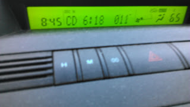
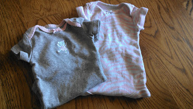
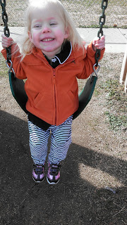
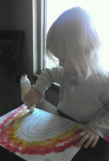
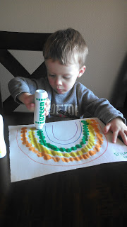

1\. After our [leisurely walk on Tuesday evening](http://amotherspace.blogspot.com/2013_03_01_archive.html#8557764487444713786) my shins were sore and my legs were tired the next day. I have a feeling this 'getting back into running' thing is going to be a little harder than I anticipated. Ugh!  
  
2\. It is much harder to get out the door in the morning with two children and a newborn. We made it to school on time this morning AND I didn't speed or stress about being late at all. I guess sometimes it pays off not to stress about things that you can't really control. Although I do need to start getting up at 6:00 instead of 6:30 on the mornings that we have somewhere to go.  
Please ignore all the dust in my car, I guess I need to add that to my to-do list.  
  

  
3\. I'm not ready for Little E to grow out of newborn clothes already. She was 8 lbs. 12.9 oz when she was born so I'm lucky that she fit in them at all. They still kinda fit but are getting a little tight on her. She's also outgrown the newborn diapers and is already in size 1. Time goes by so quickly!  
  

  
4\. The weather is finally getting nice here and we enjoyed some fun outside time yesterday. I can't wait for consistently warm/nice days so we can spend some quality time outside. Little A is loving the swings!  
  

  
5\. Happy St. Patrick's Day!  
  

  

