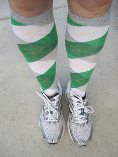
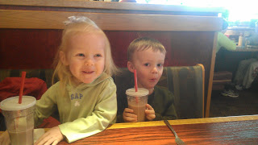
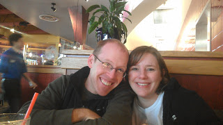
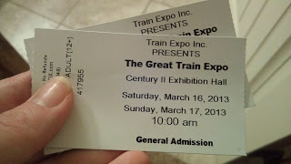
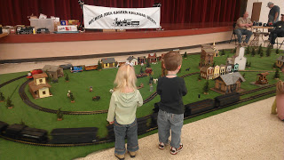
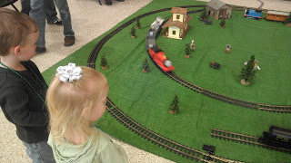
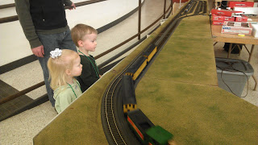
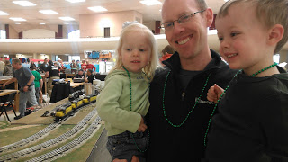

For St. Patty's Day this year I was a happy spectator. My family and I braved the cold weather (38 degrees but with a wind chill of 29. It felt MUCH colder than that!) to watch as several family members and friends ran in the St. Patrick's Day Party and Run 4 miler. 

  

This race is special to our family because it benefits the Leukemia & Lymphoma Society. My niece is currently in remission with her second fight with Leukemia so we try and support the Society and raise funds whenever we can.

  

Last year I [ran the race](http://amotherspace.blogspot.com/2012_03_01_archive.html#6051035570580026733) and was happy with my results. 

  

  

This year I snuggled with my three week old baby and enjoyed being around runners again. It just made me even more ready to get back to racing. Oh, and the snuggling is the reason I don't have any race pictures from this year. It's hard to take pictures when you are freezing and trying to keep a small baby warm. Actually, the snuggling worked really well. I was pretty toasty while holding Little E and so was she. 

  

I've discovered that we need to allow an extra half an hour to get ready to leave the house. It's just tough getting my 3-year-old, 2-year-old and newborn out the door on time. We were going to leave at 9:00 but ended up in the car at 9:30. Luckily the race started at 10:00 and even though we weren't at the starting line when the gun when off we made it to a good position to cheer on our family members as they ran by. 

  

After we saw everyone go by once we decided to head to the car for a little relief from the wind and cold. I nursed Little E and the rest of the crew had a snack to tide us over until lunch. 

  

Then we set out to watch runners cross the finish line. We didn't last long in the cold. Right after our people finished the race we basically walked over to Red Robin for lunch. Red Robin donated food for the runners and also allowed everyone to come in and sit down after the race to eat and drink their free beer. I was amazed! Even with all the runners inside, we still managed to get a table and passed the time waiting on our food by taking pictures.

  

  

  

\----------------------------------------------

  

  

We decided to skip nap time today and instead headed to The Great Train Expo.

  

  

My son loves trains and when I found out the Expo was happening this weekend I knew we had to fit it in. He was beyond excited when we got there.  I'm so glad we made the time.

  

  

  

  

  

Family, running and trains. What a great day!
