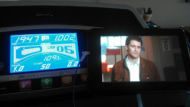
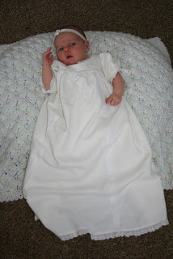
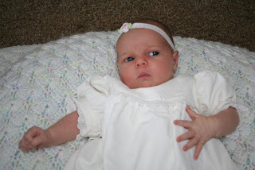
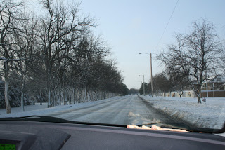
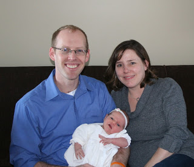

This week Little E is 1 month old. I can't believe we've had this beautiful baby in our lives for 1 month already. She's such a blessing.  
  

  
Of course, a 1 month old baby means that I am 1 month postpartum. I can't say that I am recovering like I thought I would. In some ways this has been the hardest recovery of all of my pregnancies. My legs are still 'tired' (for lack of a better way to describe it) and my back feels weak.   
  
When my doctor gave me the go ahead to exercise at two weeks after delivery, I never thought that I still wouldn't be running one month after delivery. I decided this week to start walking on the treadmill to see if it will strengthen my legs. My husband decided it was time to get back into running this week as well. So we dusted off the treadmill and he woke up early to get a short run in yesterday and I took the kids down and walked for a mile to try it out.  
  

  
I took it pretty slowly and had to stop a couple of times to help Little E fall back asleep. But I finished my mile and watched a little Glee while doing it. I didn't feel great but nothing hurt either. I'm pretty excited that nothing hurt and my legs didn't feel more tired than usual the rest of the day. Now I need to work on getting up early on the days my husband isn't running to use the treadmill before the kids wake up.  
  
I'm down about 20 pounds since Little E was born. I gained 40 pounds overall so I'm about half way there. Now that I'm hoping to begin exercising regularly I'm anxious for that number to go down. I'm in that in between stage where my maternity clothes are a little too big and my regular clothes are still too tight.   
  

\-------------------------------------

  

Last weekend we had Little E baptized. 

  

  

She was beautiful! All of my children have worn a gown my Mother-in-Law had made out of her wedding dress. 

  

  

We had a lot of family around and to make things a little interesting we also had 5 inches of snow the night before the baptism.

  

  

I really didn't think I would have to deal with this type of weather when scheduling a baptism at the end of March! Evidently, the latest we have had snow here is in May. Not in my lifetime, that I remember. I don't even remember any in April. I hope we are through with it for the year!

  

Everyone made it to the celebration safely and we had a lovely day. 

  

  

She almost looks like she's smiling in this one!
