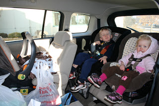
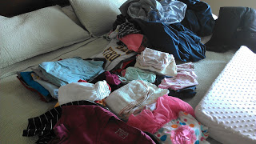

1\. It's a workout getting all three of my kids into the car all by myself.   
  

  
I snap Little E into her base behind the passenger seat and then I go around the car to climb in and buckle the two older kids in the way back. One time it was really cold so I shut the back door, forgetting that my husband had turned on the child locks and I couldn't open it again! I'm sure I was quite a sight trying to squeeze my way up to the drivers seat to get out of the car.   
  
2\. Freezer meals are fantastic. My Mother-in-Law made us seven (!!) meals after Little E was born. She is a month old and we are still enjoying some of the meals each week. So nice!  
  
3\. People always say that you take less photos of children the more you have. I actually think I have taken more of Little E because of my smart phone. Always having a camera that takes pretty good pictures right at your fingertips is fantastic. It's the reason that I have so many sleeping/snuggling pics of her for sure!  
  

  
4\. The other day I took a epic nap. The stars all aligned (the kids all slept at the same time) and I laid down and ended up sleeping for 2 (!!!) hours! I haven't taken many naps since I've been home from the hospital. It's just too busy around here with two toddlers and a newborn. I also have been feeling pretty good in the afternoon and so I always decide to get stuff accomplished instead of nap. That caught up with me this week.   
  
I was tempted to nap the next day as well but instead I piled all the laundry to be folded on our bed.  
  

  
Newborns make mountains of laundry. My washing machine runs all the time! (As I'm typing, diapers are currently in the wash.) It turned out that I didn't need to sabotage my bed to avoid a nap because the kids didn't all end up taking a nap at the same time anyway.   
  
5\. I'm so thankful that my two older children love our new baby so much. It has made the transition to a family of 5 so much easier because they have welcomed her with open arms.  
  

