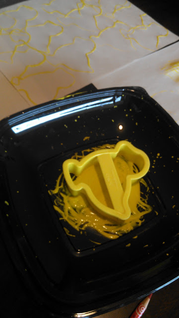

This week has been all about Easter crafts.  
Before I was a stay-at-home mom I was a preschool teacher. I'm really starting to enjoy that both of my older kids are at an age where they can do many of the activities that I used to do in my classroom.   
So I pulled out a few of my old Easter ideas and the kids have loved all of them!   
  
Of course, we dyed eggs.  
  
  

  

Then, later, we took a couple of those dyed eggs and rolled them around in paint. I LOVE this--no mess--way to paint.   
  
  

  

  
  

  
We have a ton of plastic Easter eggs and I had some that I used as a center in my preschool classroom. These eggs had letters, shapes and numbers written on them and are perfect for matching.  
  
  

  

I put out some of each so that both of my children would be challenged with the activity. My older son (age 3) knows the letters already but he enjoyed matching up the lower and uppercase letters on the eggs. I also put a couple of word family eggs in there as well. He matched up the m to the at and the c to the at to spell mat and cat, for example. My daughter (age 2) knows some of the letters but she spent more time matching the shapes and counting out the dots to match them to a number.   
  
Painting with Easter cookie cutters is another easy and fun activity.  
  
  

  

  
Anything that is messy is a hit at our house for sure!  
And lastly, we put some plastic eggs in our bean sensory bin.   
  
  

  
Scooping, shaking and making a lot of noise was great fun.  
  
I'm sure I'll be digging around in my teaching boxes again soon to pull out more fun activities for the kids!  
  

\------------

  

  
Find A Mother's Pace on...  

  
Twitter [@amotherspace3](https://twitter.com/amotherspace3)  
  
Facebook [amotherspace3](http://facebook.com/amotherspace3)  
  
Instagram [amotherspace](http://instagram.com/amotherspace)  
  
Pinterest [amotherspace](http://pinterest.com/amotherspace/)  
  
Bloglovin' [A Mother's Pace](http://www.bloglovin.com/en/blog/6680087)  
  
RSS [amotherspace](http://feeds.feedburner.com/amotherspace)
