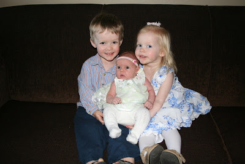
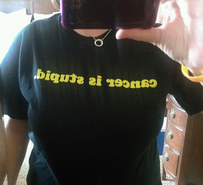

1\. I am one lucky mommy. Easter was special this year because we were able to celebrate it with the newest member of our family. I'm blessed with three wonderful children!  
  
  

  
2\. Now that I am running again I feel like I have so much energy. I think it has helped my overall mood too. Yay for running!  
  
3\. I have bunches of thank you notes and birth announcements to write and send. I NEED to get those finished and in the mail. Little E is 5 weeks old already and I just can't get motivated to work on them. MUST FINISH BY MONDAY!  
  
  

  
4\. I'm loving Charity Miles right now. They recently added The Leukemia & Lymphoma Society to their charity list and I found out about it through my local Team in Training organization. I've tried it out once and earned $.53 for my local LLS chapter! Just for doing something I would be doing anyway. #everymilematters  
  
  

  
5\. It is hit or miss with nap time lately. Either the kids all sleep or none of them do. As I'm writing this my two older kids are avoiding napping in their bedrooms and the baby just woke up. I guess it is a miss today!
