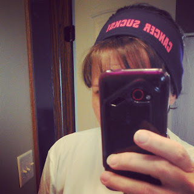

Today I'm linking up with [Miss Zippy](http://misszippy1.com/2013/04/bestru.html) to share my #bestrun.

Most people would consider a best run to include one or all of the following: great weather, speed, ease of running, or a beautiful location. My most recent best run included NONE of the above. But it was fabulous and I enjoyed every second of it.

Last week I ran in the afternoon. My mom came over to watch my 3 children (ages 5 weeks to 3 years old) and I hit the pavement.

Weather:

I had been looking forward to the run all day even though it was cold out.  As I was putting on winter layers getting ready to run I decided that I was probably one of the only runners excited to put on the extra clothing. My winter running clothes didn't get worn very much this past winter so pulling them out in the spring was a little exciting for me. Boy, was I glad I had them on. It was windy, cold and even rained on me a little.

Speed:

Since I've started running again I'm slow. I wish that my fitness level was the same as when I stopped running but obviously it is very different. It's going to take some time to build it back up again and this run was no exception.

Ease of Running:

This one goes hand in hand with my lack of speed. Overall running is tough but even what I would typically consider an 'easy' run is difficult right now. I'm building up my base again and I know that by working hard at it I'll slowly gain both speed and ease.

Location:

My most recent best run happened in my neighborhood. While I love where I live, running up and down courts and circles isn't the most scenic location.

So why, if I had all of these factors going against me, do I consider this my most recent best run?

Two reasons, really.

I've just started running postpartum again and I'm excited to run no matter what the conditions. I'm definitely NOT taking running for granted right now and I'm enjoying every second. The conditions don't matter, my performance doesn't matter and the scenery doesn't matter. This run was special (or my #bestrun) because I realized all of this during this run. Everything was going against me but I still loved it.

<table cellspacing="0" cellpadding="0" align="center"><tbody><tr><td></td></tr><tr><td>photo via <a href="http://instagram.com/amotherspace" target="_blank">instagram</a></td></tr></tbody></table>

This run was also my first time to use @CharityMiles to raise money for The Leukemia & Lymphoma Society. Especially considering that I was doing something that I was going to do anyway, it's pretty fantastic that I was able to earn $.56 for my favorite cause. #everymilematters

So now it's your turn. Link up with [Miss Zippy](http://misszippy1.com/2013/04/bestru.html) and share your #bestrun. Or tell me about your best run in the comments below.

\-------------------------------

Find A Mother's Pace on...

Twitter [@amotherspace3](https://twitter.com/amotherspace3)

Facebook [amotherspace3](http://facebook.com/amotherspace3)

Instagram [amotherspace](http://instagram.com/amotherspace)

Pinterest [amotherspace](http://pinterest.com/amotherspace/)

Bloglovin' [A Mother's Pace](http://www.bloglovin.com/en/blog/6680087)

RSS [amotherspace](http://feeds.feedburner.com/amotherspace)
