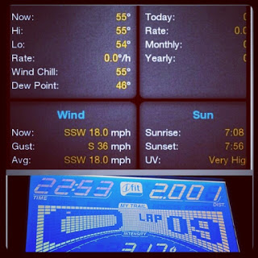
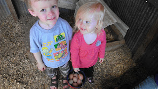
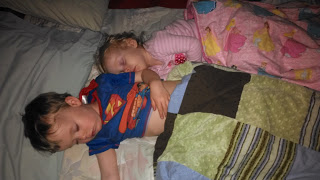
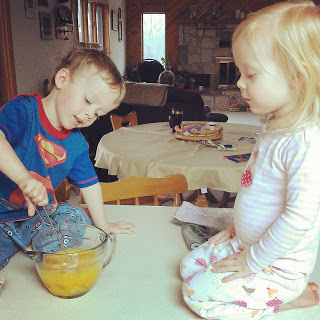
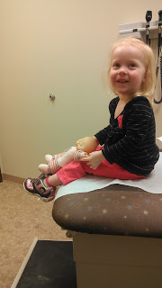

Last weekend we had plans to visit Nana and Papa's house. Before the weekend got super busy I wanted to get a run in and lucky for me, Little E decided to help me out with that. She woke up at 5:00 a.m. to nurse and instead of going back to sleep when she was finished I decided to head downstairs to the treadmill. The entire time that I was feeding Little E I was debating heading outside but after looking up the wind gusts on my phone there was really no decision for me.  

  

<table align="center" cellpadding="0" cellspacing="0"><tbody><tr><td></td></tr><tr><td>photo via <a href="http://instagram.com/amotherspace" target="_blank">instagram</a></td></tr></tbody></table>

  

I opted for the treadmill to avoid the howling wind outside. Does that make me wimpy? Maybe, but I did get my run in.

  

I'm also getting (a little) faster. I looked up a [pace conversion chart](http://www.hillrunner.com/training/tmillchart.php) online which really helped me run closer to my normal (postpartum) speed outside. I find that the treadmill is more difficult than running outside and so I tend to run slower on it. Although it feels like I am running so quickly! I'm always disappointed when I finish a workout only to find out that I was a lot slower than I thought. So, that's why I looked into the pace conversion chart and I'm so glad that I did. 

  

I started out at speed 5 and just went up .2 every half mile. I ended up with an 11'26" pace. It's definitely not my pre-pregnancy pace but it is a little bit faster than I have been running both on the treadmill and outside. 

  

After the treadmill we rushed around to load up the car and head out of town. 

  

We made it to Nana and Papa's house with plenty of time to play and have fun in the afternoon. 

  

There was a visit to the neighbors hen house.  
  

  

Some snuggling at night.

  

  

Farm fresh eggs in the morning. Those were some pretty fantastic eggs. It's always a good idea to eat locally and to know where your food comes from. The kids learned a lot about the eggs this weekend.

  

  

And even a trip to Immediate Care.

  

  

She was in a pretty good mood at this point. Little A fell out of her chair (at the kids table!) and hit her mouth just right on the table (we think). We went in to the doctor just to be safe and make sure that her gums and her teeth were o.k. Doctor said she was fine and gave us some tips to help the swelling in her lip go down. 

  

Quite an exciting weekend!

  

  

Do you like to run in the wind?

  

What other types of weather send you to the treadmill?

I don't like ice or deep snow. Usually wind doesn't keep me inside but today it did.

  

Any interesting ER visits lately?
