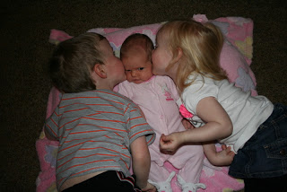
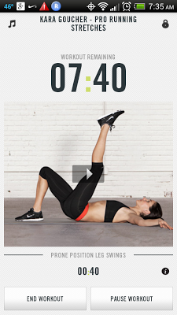

Happy Marathon Monday!  
  
In honor of Kara Goucher running the Boston Marathon this morning I am writing about my new favorite post run stretching routine.  
  
I've always been o.k. at stretching. Not great, just o.k. When I run outside I stretch by the back steps and even use the steps for some of my stretches. This usually lasts about five minutes before I go back inside and refuel, shower and do any other various mommy duties. Not necessarily in that order.  
  
  

<table align="center" cellpadding="0" cellspacing="0"><tbody><tr><td></td></tr><tr><td>They love their baby sister!</td></tr></tbody></table>

Because I am 7 weeks postpartum I am trying to be really smart about returning to running. I don't want to get injured and have to sit out again. This includes a proper warm up, cool down and also stretching when I'm finished running.   
  
I recently discovered the [Nike Training Club](http://www.nike.com/us/en_us/c/womens-training/apps/nike-training-club) app for my phone...and it's free! So far the only workout I've completed is Kara Goucher's Pro Running Stretches. I can't get past it because every time I go to find a workout that one pulls me in.   
  
  

<table align="center" cellpadding="0" cellspacing="0"><tbody><tr><td></td></tr><tr><td>A screenshot from my phone.</td></tr></tbody></table>

The workout lasts 15 minutes with a rotation of five stretches lasting 1 minute each. It takes you through the exercises 3 times. The stretches are easy and I feel better after going through the whole routine. I've never stretched so well after running! My favorite move is the Prone Position Leg Swings, shown above. Not only does it loosen up my legs but I can feel it in my (nonexistent, postpartum) abs.   
  
Check it out [here](http://www.nike.com/us/en_us/c/womens-training/apps/nike-training-club) if you are looking for a fun new stretching routine.  
  
I'm planning on watching the Boston Marathon later this morning and I'll be cheering for both Kara and Shalane. I'm definitely a #runnerd because the thought of watching people run 26.2 miles today is super exciting!  
  
  
  
Are you planning on watching the Boston Marathon?  
  
Who are you cheering on?  
  
Do you stretch before or after running?  
  
What is your stretching routine?
